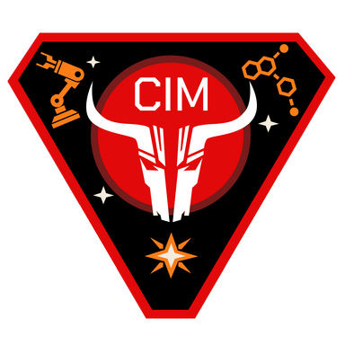
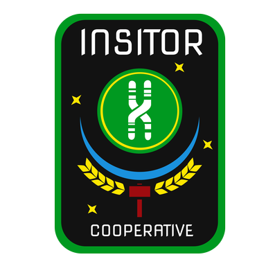
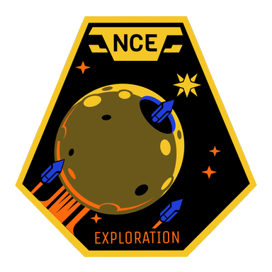

## Antares Initiative

|    |    |
| -- | -- |
| Name | Antares Initiative |
| Code | AI  |
| Currency | Martian Coin (AIC) |

At the time the planet-killer was discovered, early colonization efforts on Mars had just started to bear fruit. Not quite self-sustaining yet, the young colony had to decide whether to focus on making Mars habitable, accepting the risk of unknown consequences caused by a total destruction of earth, or to divert resources to the exodus project. The population was divided over the topic and eventually, the Antares Initiative split off to pursue a cost-effective way to reach the new homeworlds. Their technology is very basic and makes use of whatever was available on Mars at the time. They were among the first to leave and did so with many small, autonomous ships. Due to their sub-standard propulsion systems they only arrived very late in the colonies.

## Castillo-Ito Mercantile

|    |    |
| -- | -- |
| Name | Castillo-Ito Mercantile |
| Code | CI  |
| Currency | Sol (CIS) |

Castillo-Ito Mercantile is the result of a merger between the Ito Robotics Corporation, a world leader in robotics and automation technology, and the Castillo Group, an international holding company dealing in just about everything including minerals, energy, transport and financial products. Combined, the company’s net worth easily surpasses that of most smaller European countries combined. They entered the exodus project early on and had a clear strategy in mind from the get-go. Carefully selecting promising planets in strategic locations, they assembled a fleet of reliable generation ships, all of which successfully made the trip to and landfall on planets in 4 neighboring systems. With access to many crucial resources, they plan on fueling their ambitions plans to become a major force in the new worlds.

## Exodus Council

|    |    |
| -- | -- |
| Name | Exodus Council |
| Code | EC  |
| Currency | Exodus Council Drawing Rights (ECD) |

After initial attempts on part of various nation-states to get programs to build generation ships off the ground, it quickly became apparent that private entities were a lot faster in achieving this goal. In fear of losing control over the process, well-connected politicians and other individuals of influence used their networks to force any company that planned on leaving for the new worlds to join the newly founded Exodus Council which oversaw the allocation of surveyed systems to interested parties. The original bidding system designed for this purpose later turned into the omnipresent APEX system used for everything related to transnational and later trans-planetary trade and commerce. As the Exodus Council made money with more or less every transaction related to the exodus project, they came to enormous financial resources. Combined with the intelligence at their disposal they were able to launch generation ships themselves. They were by far the fastest and most advanced models sent out and despite leaving relatively late, were among the first to reach the new systems. They picked a single well-located star system along very likely trade routes to all other factions to found their colony. Instead of colonizing the system's planets they transformed their colony ships into one big space station known as Cibola Station.

## Insitor Cooperative

|    |    |
| -- | -- |
| Name | Insitor Cooperative |
| Code | IC  |
| Currency | Austral (ICA) |

Before the exodus, South America had become the breadbasket of the world and the countries and corporations of the continent had their mind set on becoming the same in the new worlds. Coordinated by the Insitor Bank, a cooperative owned and controlled mostly by agricultural and bio-tech companies, they opted for a monolithic approach, building a single huge, completely self-sufficient generation ship with more greenhouse and livestock capacity than any other design pursued by other factions. To satisfy the enormous need for resources, they pushed their governments to nationalize most of the private mining companies. Their colonization target was a very fertile planet they christened Promitor.

## NEO Charter Exploration

|    |    |
| -- | -- |
| Name | NEO Charter Exploration |
| Code | NC  |
| Currency | NCE Coupons (NCC) |

NCE started out as one of the first space-based mining corporations. A charter granted by a European monarchy allowed them to exploit the name-giving near-earth objects between Earth and the Asteroid Belt. When the news of the exodus project broke, they already had the necessary infrastructure in place to start construction of a large generation ship right away. For this purpose, they captured a small asteroid, hollowed it out and used the excavated minerals to manufacture most required systems in place. All of this happened in relative independence of Earth, but NCE still opted for participation in the APEX system to gain access to funds and components that were only available on Earth. After their arrival in a mineral-rich star system, they parked the generation ship on an orbit around one planet and quickly sent smaller ships to make landfall on a second one.

