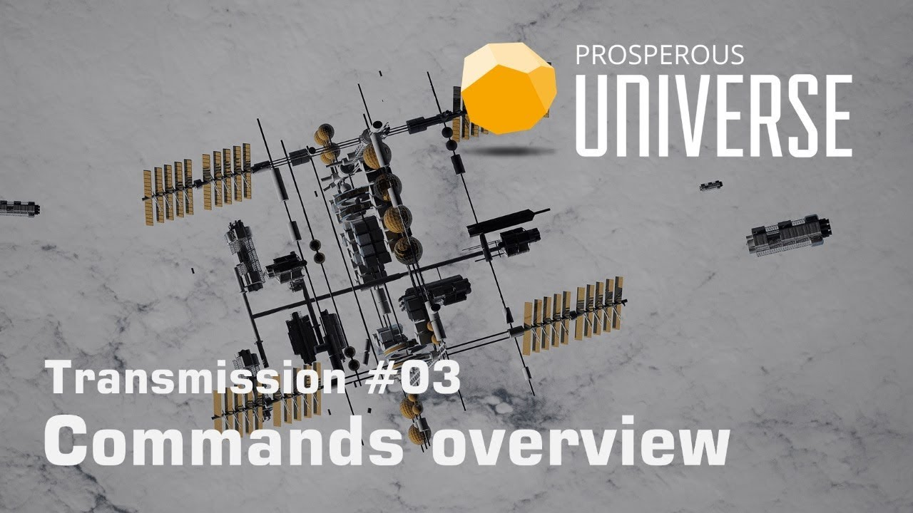

This page lists all  will introduce you to the [APEX interface](LINK) (just “APEX” below) and its basic components. It is also available in video format. __Click on the image below to watch the video or scroll down for the written version.__

## Overview

## More tutorials

If you are first starting out, check out the “APEX overview” and “Getting started” tutorials:
* [APEX overview](LINK)
* [Getting started](LINK)  
* [Space flight](LINK)  
* [Foreign Exchange](LINK)  
* More to come!

Use the arrows below to cycle through all available tutorials in order, from introductory to more and more specific topics.