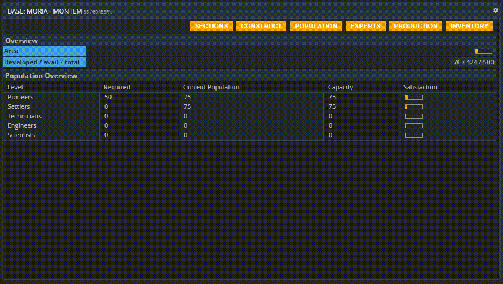

This page explains how commands in your APEX console work. If you are looking for a comprehensive list of commands, head on over [to the wiki](../../wiki/commands-list).

This tutorial will soon become available in video format. __Please scroll down for the written version.__

## General rules

You do not _need_ to use commands at all to use APEX. However, some commands will prove useful to get to a desired piece of content quickly. There are shortcuts for the most important ones in the left sidebar, including the “CMDS” command, which opens a list of all commands - there is no need to memorize them all.  

Many windows list related commands at the top. Use them to quickly access similar content.  

Commands can be entered into an empty buffer or an empty tile. (When emptying a tile or buffer, you can still see the command that was previously displayed.)  

Commands are not case-sensitive, meaning that you can use uppercase or lowercase letters as you please.

Every tile and every buffer in APEX corresponds to a command, no matter which way you opened it. The command can always be seen right next to the window’s title. Take for example the Base command shortcut: In the buffer that opened up, you can see a that it corresponds to the “Base” command, even though you did not enter it by hand. Clicking “View Base” from there opens a specific base using the same command, followed by a parameter. Clicking “Population” calls the “POP” command, clicking “Production” calls the “PROD” command, clicking “Inventory” calls the “INVP” command and so forth.

## Parameters

Open up the CMDS buffer by selecting its shortcut on the left side. Looking at the commands list, you will notice that some commands take so-called parameters, some of which are listed as mandatory, some as optional. Commands with no parameters can only be entered on their own. Some commands need to be followed up with a parameter, and if a parameter is optional, the command by itself has a general use, but it can be followed by a parameter to display more specific information. Lastly, notice that some parameters in the commands list are called “tickers”. As you will see in the Commands list, the term’s meaning depends on the exact context.

__Example:__ The “BS” command by itself shows an overview over all your bases. Clicking “View Base” next to a concrete planet in the list opens a new buffer in which the Base command is followed up by the respective base’s ID. Clicking the Sections (“BSL” command), Production (“PROD” command), and Population (“POP” command) buttons in this window, you will find that the base’s ID is used by all these commands as well because they relate to this concrete base’s Sections, Production, and Population. (The Inventory, meanwhile, is followed up with the planet’s identifier.) These three - BSL, PROD and POP - _must_ be followed with a parameter, specifically a base ID. That is because, when looking at Sections, Production Lines, or a Population, it always pertains to a specific base.

Another example for the use of (mandatory) parameters would be the “MAT” command. When entered by itself, APEX will wonder which material you want to learn more about. That is why “MAT” must be followed by a material’s ID, like “CUO” for Copper Ore.

## About this page

This page is part of the advanced tutorial series, which encompasses parts 3 through 7. Use the arrows on the sides to cycle through all available tutorials in order, from introductory to more and more specific topics.

If you encounter an error or cannot find the answers to your questions, we will gladly help you on our [Discord server](https://discordapp.com/invite/G7gj7PT).