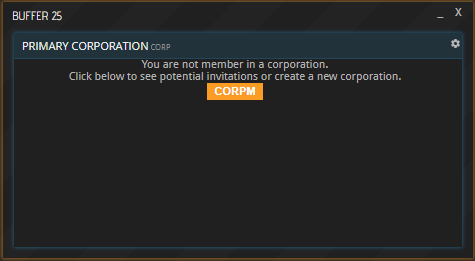
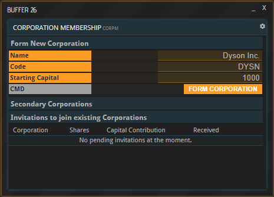
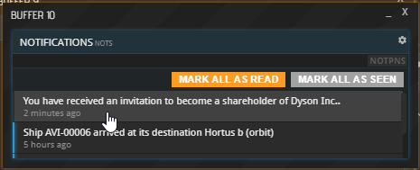
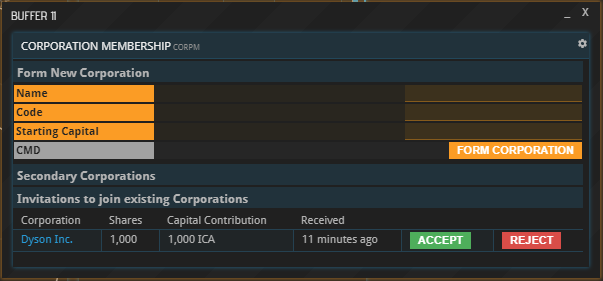
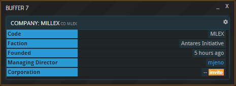
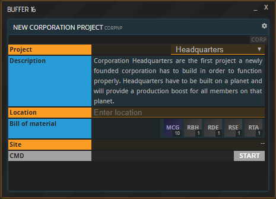
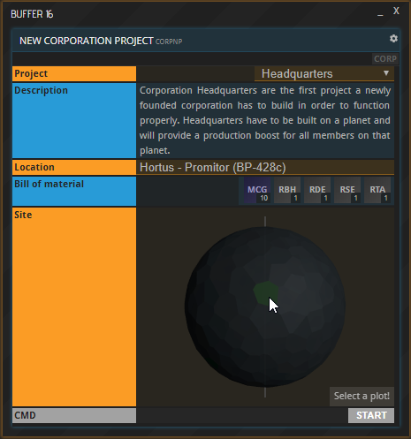
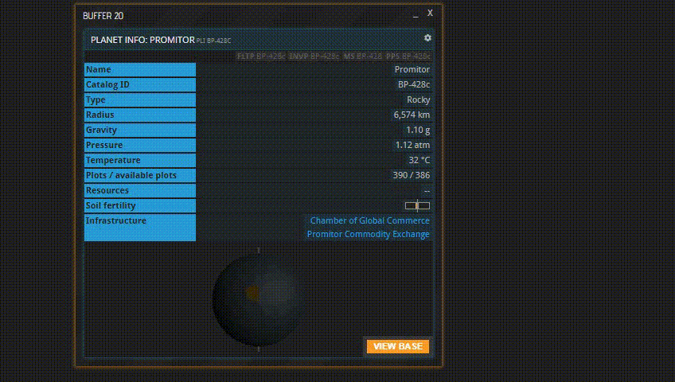
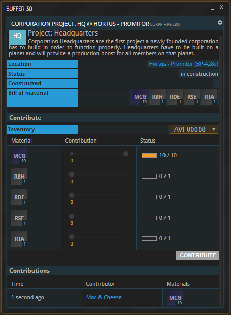

This tutorial is also available in video format. __Click on the image below to watch the video or scroll down for the written version.__

## Introduction

Corporations are legal entities similar to the companies by whom they are owned. More practically speaking, corporations act as banners under which several companies can band together to pursue common goals and realize collective projects. Companies obtain (partial) ownership of a corporation by purchasing shares, thus becoming so-called shareholders.

Please note: As of now, it is only possible to become shareholder of a single corporation. In the future, APEX will allow licensees to buy shares of multiple corporations. However, each licensee will only have one Primary Corporation allowing them to influence its decisions, to enter its comm channels etc. The rest will remain so-called Secondary Corporations in which a licensee only owns shares without any of those privileges.

## Founding a Corporation

If you are not yet member of a corporation, you can start one yourself. Selecting the CORP shortcut on the left, you will be greeted by this text:

Click the CORPM button. You now have two options: Found your own Corporation in the upper half of the new buffer, or join one you have been invited to in the lower half. The latter case will be explained below under “Joining a Corporation”. Enter the desired Name and Code of your corporation as well as its starting capital, which will default to your faction’s currency. Each invitee to your corporation will have to pay their shares in the same currency.

Once you select “FORM CORPORATION”, your corporation is ready to go. Congratulations! Read the paragraph titled “Corporate actions and projects” to learn how to invite others and what else to do with your corporation.

## Joining a Corporation

If you have been invited to a Corporation, you will receive a notification. It is accessible via the NOTS button in the top right of APEX. Clicking it will take you to the CORPM command, which you can alternatively enter into a new buffer by hand. 

Under “Invitations to existing Corporations”, you now have the ability to answer to your invitation. Rejecting an invitation will delete it forever, accepting it will instantly buy the shares needed to become a member. This is the same amount the founder acquired when forming the corporation, and it will need to be paid in the same currency (ICA in the example below). If you do not possess the required currency, the only way to achieve it is via foreign exchange.

## Corporate actions and projects

### Inviting a company

To invite another company to your corporation, bring up their company information in a new buffer by entering “CO” followed by the respective company code. 

Next, click the “invite” button next to the label “Corporation”. In the new window, select “INVITE COMPANY”.

### Corporate comm channel

Each corporation has its own communications channel, which is accessible to all shareholders. It can be entered by selecting the COM button at the top of the CORP window. Alternatively, you can access the command directly by entering “COM” followed by “CORP-” and the corporation ID.

### Corporate projects

Corporate projects provide different advantages to a corporation’s members. Once you are part of a corporation, you can start a corporate project by selecting “START PROJECT” in the CORP window or by directly entering the CORPNP command into a new buffer. The first corporate project that must always be built before any other project is the corporate headquarters. (Note that corporations can exist and operate without having headquarters.)

Select the desired project from the dropdown at the top. It will take up a plot on the planet you enter into the line labeled “Location”. After indicating a planet name or ID, the planet will appear, and you need to click the desired plot. If you are not satisfied, choose “change selection” in the bottom right and pick a different one. Lastly, hit “START” at the bottom of the window.

Once done, the planetary project will appear as a colored plot on the selected planet. Clicking the plot will open the CORP window. Unlike planetary projects, corporate projects do not appear in the Infrastructure list.

The corporate project will now appear in the “Infrastructure” section at the bottom. At this point, the project does not exist yet since it must first be built by the corporation’s shareholders. Selecting “contribute” next to the project’s name will open up a buffer in which you can chip in towards the project’s construction. 

Select the storage to take resources from, adjust the slider(s) to select the amount you would like to donate and finalize the process by hitting “CONTRIBUTE”. At the bottom, you can see all the contributions that have been made by shareholders towards the realization of this project. 

Once all required contributions have been made and the status bars are full, the corporate project will become operational.

#### Corporate headquarters

Corporate headquarters are not a necessity for a corporation to be functional. However, they are the first corporate project that must be realized before any other corporate projects become available.

## More tutorials

If you are first starting out, continue with “Getting started”:  
* [Getting started](LINK)  
* [Space flight](LINK)  
* [Foreign Exchange](LINK)  
* More to come!

Use the arrows on the sides to cycle through all available tutorials in order, from introductory to more and more specific topics.