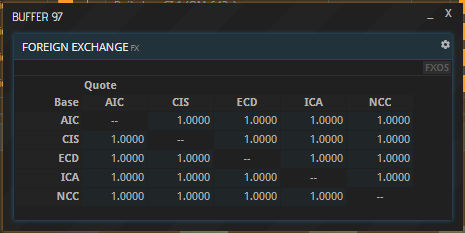
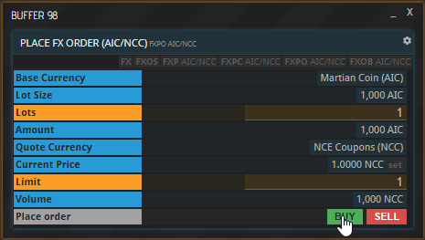
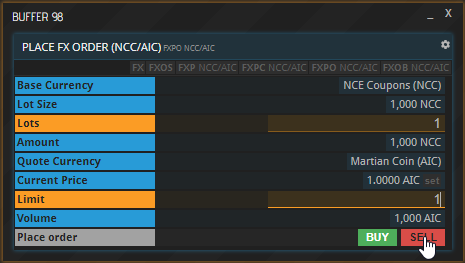
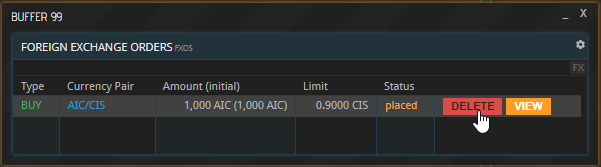

This guide is also available in video format. __Click on the image below to watch the video or scroll down for the written version.__

Please note that Foreign Exchange trading is only available for APEX PRO users. If you acquired a [PRO License](https://hub.prosperousuniverse.com/license/purchase), follow along the steps below in APEX.

## Viewing exchange rates

At some point, either by necessity or by choice, you are going to be confronted with a foreign currency. As long as you stay within a single system, people on the markets around you are going to trade in your currency. However, if you need to buy a commodity from a planet controlled by a different faction, you will have to pay in that faction’s currency, which you have to buy first.

To find out the exchange rate of two currencies, you have several options. Entering the FX command shows you a matrix of exchange rates. You can see how much of one currency - the base currency - is worth in terms of another - the quote currency. The base currencies are arranged vertically, the quote currencies horizontally. For example, if a value in the matrix was 2, it would mean that one of the currency in that line is worth two of the currency in that row.

Note that each combination of two currencies occurs twice in this matrix, because all currencies are listed both horizontally and vertically. This is actually not a redundancy, but allows for arbitrage, which will be explained further down below.

To isolate a pair you are specifically interested in, click the respective value in the matrix. Alternatively, you can use the FXP command followed by a ticker, which in this case is two currency identifiers divided by a slash or dot. As an example, have a look at the exchange rate of AIC and CIS by entering “FXP AIC/CIS”. 

## Buying a currency

To buy a commodity, you have to place a buy order at a Commodity Exchange. Similarly, to buy currency, you have to place a buy order in a Foreign Exchange window. Unlike Commodity Exchanges, foreign exchange isn’t tied to a specific location and can be done from everywhere. Another difference is that you will not be able to select a currency from a dropdown menu like you do a commodity. Instead, each pair of currencies has its own window.

To place an order, open a new buffer and enter “FXPO” followed by a blank. Then enter the currency you want to buy or sell followed by a slash, and then the currency you want to use as payment (to pay in or to be paid in). For instance, to buy Martian Coin for NCE Coupons, enter “AIC/NCC”. Then enter the amount and hit the “Buy” button.

Entering the two in the opposite order and then hitting “Sell” would have essentially the same effect, but not _quite_, as explained in the paragraph titled “Arbitrage” below.

Note that you are trading so-called Lots. One Lot is 1000 units of a currency, which applies to both the currency you are spending and the one you are buying. That means that the spending Limit you indicate is also multiplied by one-thousand. Use decimal numbers like 0.5, 1.001 or 0.75 to fine-tune your bid.

## Order history & exchange rates history

You can view all foreign exchange orders you have placed using the FXOS command. As is the case for Commodity Exchanges, your buy order is not filled until someone else places a corresponding sell order. To withdraw an order that has not yet been filled or just been partially filled, simply click the “DELETE” button next to it.

To view the history of the exchange rate of any currency pair, use the FXP command followed by the desired ticker, for example “FXP AIC/CIS”. Select the time window you want to see at the top.

So far, so good. However, it gets more complicated than that. To ensure that you do not make a very common mistake, you need to understand one more thing.

## Arbitrage

You can see in the picture above that one company is requesting to buy one Lot of AIC. To better understand, think of the AIC as the commodity in this scenario. The currency in which the commodity shall be paid is CIS.

In this screenshot, we have the opposite example. A different company is looking to buy CIS, which is the commodity here, and it is paid in the currency AIC. The exchange rate between all currencies is currently one point zero. You would think that if one company is buying currency A for currency B, and another company is buying currency B for currency A, the two orders should match each other perfectly. Yet, they are both still pending. Why is that?

The reason is that the two base currencies, the ones being bought, are not actually treated as currencies here, but rather - as mentioned above - as commodities. If you look at it like that, these two companies are interested in buying two different commodities, so they don’t have anything to do with each other. You can already tell from the commands at the top of these buffers that they are not in the same business, so to speak. The upper one says “AIC” - which is the base currency, the commodity - and after the slash “CIS” - which is the quote currency, the actual money to pay for the commodity. The company’s owner entered these values and then hit “Buy”.

In the second screenshot, the command is the other way around, which tells us instantly that these two orders cannot match. “CIS” is the base currency, the commodity, and “AIC” is the quote currency, the money. Like the other one, this company’s owner placed a Buy order.

What does this second company here have to do in order to match the order of first one, so the trade can happen? Enter the two currencies in the same order the upper one did and then hit “Sell”. This way, the commodity is AIC in both orders. One is buying it, the other is selling it.

Why so complicated? In an ideal world, you would assume that the exchange rate from currency A to currency B is the exact reciprocal value of the exchange rate from currency B to currency A. This would mean that if you can get one AIC for exactly 0.5 CIS, you get exactly two CIS for one AIC. However, in reality, there is a small deviation in their exchange rates, meaning that they are not in fact perfect reciprocal values. Actively exploiting this deviation is called arbitrage, which can become a whole business venture in and of itself.

## About this page

This page is part of the advanced tutorial series, which encompasses parts 3 through 8. Use the arrows on the sides to cycle through all available tutorials in order, from introductory to more and more specific topics.

If you encounter an error or cannot find the answers to your questions, we will gladly help you on our [Discord server](https://discordapp.com/invite/G7gj7PT).