This guide will teach you all you need to know to get your company off the ground [APEX interface](LINK) (just “APEX” below). It is also available in video format. __Click on the image below to watch the video or scroll down for the written version.__

Follow along the steps below in APEX.

## Part 1: Fundamentals

### Company name & code

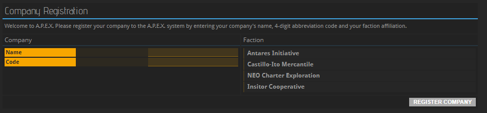
When logging into APEX for the very first time, you are asked to provide the name and code of your company. The name you choose must not violate APEX’s terms of service, meaning that if it isn’t offensive or too similar to the name of an already existing company, anything is possible. The code is an abbreviation, an identifier, used for looking up your company within APEX. It must be four letters long and, like the company name, it needs to be unique.

### Factions
Next, you get to pick which faction you want to belong to. Picking a faction will not limit where you can go or what you can do with your company. All factions peacefully coexist and won’t harm you if you want to do trade in another faction’s territory. However, factions reign over certain sections of space, each with their own currency and set of rules.

Joining a faction means that you can set up your first base on a planet it controls, which is the most immediate consequence of picking a faction at this point. Planets have different properties which help with or impede certain trades. For example: The Moria system, which is controlled by Neo Charter Exploration, provides better conditions for anything related to mining due to its mineral-rich planets. The Insitor Cooperative, meanwhile, specializes more in food production because that is what the planets in the Hortus System lend themselves to.	

### Planet

The next step is picking the planet on which to set up your company. Selecting one in the dropdown menu provides you with further information: Each planet is subdivided into bits of land called Plots. Each company claims exactly one plot on a planet; if no plot is available, the planet is full and you need to pick another one. You can also see a list of resources that can be extracted from this planet as well as an indicator of how fertile the planet is, meaning how easy or hard it is to grow plants there. The further the yellow bar goes to the right, the better the planet is suited for farming.

The line titled “Commodity Exchange” is very important: If it says “none”, no goods can be traded on this planet. If you build your base on a planet without a Commodity Exchange, you will need to send ships to a planet that has a Commodity Exchange in order to buy or sell anything. This means that trading gets more expensive because you need to account for the fuel required for shipping. You will also need to wait several hours for the things you purchased to arrive, including the very basic construction materials you need to set up your base and start working. On the other hand, you might have access to a more fertile environment or rare minerals on your planet that other traders will pay good money for. If this is your first time using APEX, it is strongly recommended that you pick a planet with its own Commodity Exchange.

### Package
Lastly, APEX wants to know what kind of company you will be running, i.e. in which supply chain you will be operating. If you are bringing a team of experts in the agricultural field with you, choose Agriculture. Over time, new experts will emerge from your workforce granting you more and more optimized output of goods in their field of expertise. You can change your profession at any later point in time, but it is going to take time to make that change and develop experts in a new discipline. The choice you make now is going to impact your company’s direction for a long time.

## Part 2: Building Your Base

### Base setup
After making your choices, you get access to APEX. Welcome! Thank you for putting your trust in us. You can now begin setting up your base.

_Please note that the default layout screen may look different for you._

On the Universe Map, you can see an arrow pointing at the system where your starting ships are stationed. If you do not see an arrow, check if there is a yellow bar next to the word “Fleet” in the Universe Map. If there isn’t, click it now to toggle on the display of your Fleet.

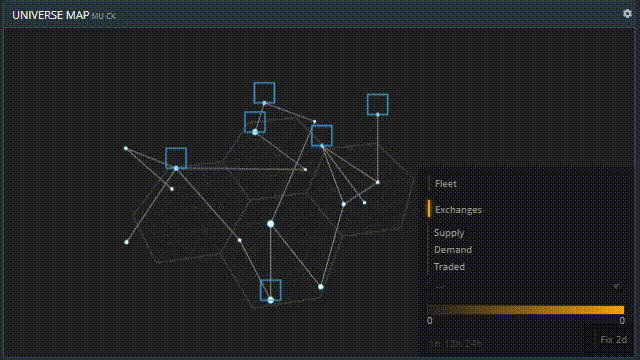

Click the system the arrow points to, and the system will open in a new buffer. Now find the planet marked with the same arrow. You can then see a 3D render of your starting planet, and a button for building your base. (If you are a more experienced user already, you may choose to leave your starting planet right now and fly to a different one to set up your base there. Just make sure that your starting planet is of the “Rocky” type and its temperature lies between –25 and +75 degrees Celcius, or you might not be able to afford the construction materials required to survive in such a harsh environment.) If, however, you want to set up your base right here, which is strongly recommended if you are new, click “Construct Base” to see which building materials you need. If it says “missing” underneath some or all of them, click the dropdown menu and select the other ship Transponder code. One of your ships has the resources you need in its cargo hold. Next, choose an empty, grey Plot to place your base module on. Congratulations, you now have a base!

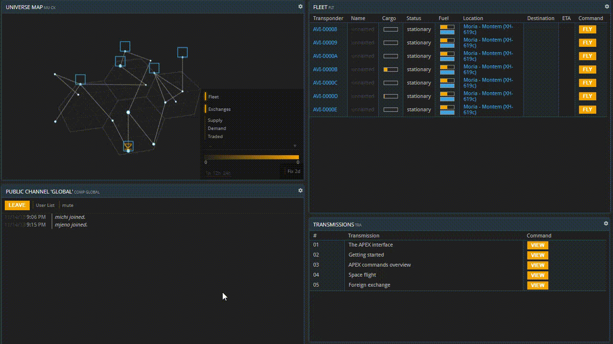

### Finding required structures

Clicking “VIEW BASE” opens a buffer you are going to need a lot. You may want to drag it into an empty tile right now.

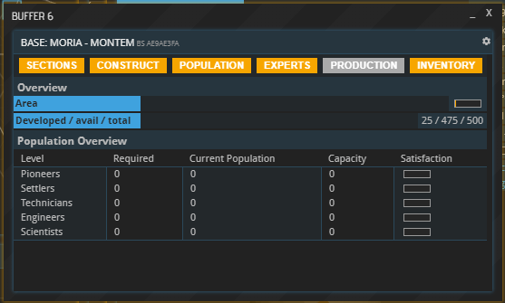

Hitting “Population”, you can see that there are no people in your base yet. Your workforce is divided into several levels of specialization, from Pioneers to Scientists. Which kind of worker your company needs depends on the purpose it serves in your particular supply chain.

Opening up the “SECTIONS” buffer shows that there are no buildings in your base apart from the Core Module. That is why you first need to erect some structures for your workforce to live and work in.

Hit “CONSTRUCT” to see what you can build. You will notice that this buffer is organized in multiple tabs. Under “Infrastructure”, you find all buildings that can hold people or goods. The three different Habitation Modules harbor different kinds of workers: Hab 1 increases the Pioneer population by 100, Hab 2 is for settlers and Hab 3 for technicians. You are very soon going to find out which kind you need. Lastly, the Storage Module increases your storage capacity. However, the Core also serves as storage, so you do not need a designated Storage Module right now. All the other tabs contain buildings that produce goods, sorted by the kind of workers needed to operate the buildings. The only exception is the Resources tab, which only contains buildings that require Pioneers, like the Pioneers tab does.

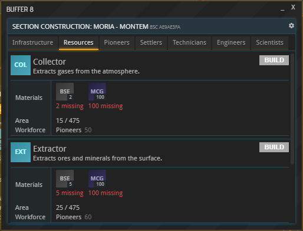

It is important to understand that every supply chain on the list you picked from earlier – Agriculture, Resource Extraction, Metallurgy etc. – encompasses buildings in several of these tabs. As a general rule, the more basic buildings of any supply chain are operated by the lower-level workforces like Pioneers and Settlers, and the further you go to the right, the more advanced the buildings and their workforces become. Now let’s see which buildings are relevant to your company.

The most basic buildings can be found in the Pioneers and Resources tabs. Read through the descriptions of buildings in these tabs. To be certain whether or not constructing a particular building makes sense for your company, click it and check what its “Expertise” property says.  For example: The Prefab Plant 1 will profit from Construction experts. However, there are also more advanced buildings a construction company can use, like the Prefab Plant 2 in the settlers tab as well as the Prefab Plant 3 and the Small Components Assembly in the Technicians tab. However, you should start with the most basic building in the lowest tier available. In the beginning, you won’t be able to afford the building materials required for more advanced buildings or the Habitation Modules of higher-level workers, much less their upkeep.

Look for the lowest-tier building or buildings in your supply chain. For Agriculture, that would be the Rig and the Farm; for Supplies, the Food Processor; for Mining, the Extractor; the Smelter for Materials; and the Prefab Plant 1 and Building Materials Plant for Construction. Be careful: If your industry has two basic buildings, don’t buy both of them right away. Limit yourself to one, since you will have to first build some more structures to get started. If you still have money at the end of this tutorial, you may elect to buy a second building that produces goods.

__COMING SOON: Guide on which buildings to buy depending on starting package__

Next, you will need to buy the materials required to construct your building. While you are at it, also buy construction materials for your workers’ housing. Click the icon of the desired Production Line (i.e. building that produces goods) and check the “Workforces” tab. It will most likely show that a certain amount of Pioneers is required to operate it. To get 100 Pioneers, you will need a Habitation Module One. 

You now know which buildings you need in order to start producing. Unfortunately, you are currently missing the resources required to build them. You might want to write down the commodities you need to erect your two first buildings. In the next step, you will learn how to acquire them.

### Buying Commodities

Each market, or “Commodity Exchange”, is on a specific planet or a specific space station. There are several ways to find your closest Commodity Exchange. The easiest is opening the System map, finding the planet on which your base is located and then checking whether it or any of the close-by planets show a little chart symbol when hovering over them. You can also find a list of all commodity exchanges using the CXL shortcut in the left sidebar.

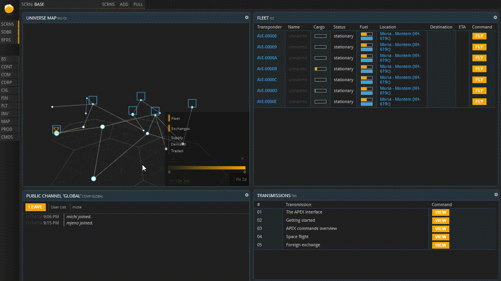

If your planet does not have its own Commodity Exchange, you will need to send ships to a planet or station that has one in order to trade. (Make sure you do not trade on a market in another system before you understand foreign exchange because you are likely to need a different currency there.)

Click the Commodity Exchange symbol. You should integrate this buffer into a tile now because you are going to need it frequently. Note that all products are listed in every Commodity Exchange, but the buy and sell orders you can see are always limited to the Commodity Exchange on which they were placed. They are not global – if, for example, the product you want is not being sold on your Commodity Exchange, have a look at the Commodity Exchanges of other planets and stations.

To find the parts you want to buy, you need to select “Construction Prefabs” from the Exchange’s dropdown menu. Now look for the parts you wrote down earlier. Once you find one of them, click “Orders” next to it, and you can see the prices that this commodity is currently being offered for (labeled “Offers”) and a list of interested buyers as well as the prices they are willing to pay (labeled “Requests”).

Close the buffer now and select “Trade”, right next to the “Orders” button. The “Storage Location” line in the new buffer is only relevant if you are placing a Sell Order, so the system knows in which Inventory to look for the commodity you are selling. Right now, you want to buy, so you can ignore it. Now enter the Amount you want to buy and indicate how much you are willing to pay per unit under “Limit”. The cheapest current offer is listed under “Current Price”, and if you want to get the parts right now, you will have to pay that price.

Besides Construction Prefabs, constructing a Section also requires Construction Materials. Select Construction Materials from the Commodity Exchange’s drop-down menu now. To build on a rocky planet, you need 100 units of Mineral Construction Granulate per building. (Gaseous, hot, and cold planets have special requirements.) Go ahead and buy the Construction Materials you need, in the same way you bought the Building Materials before.

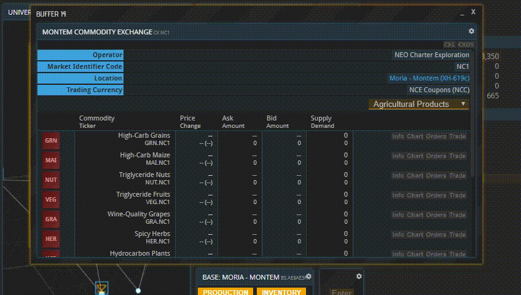

If you were to set the Limit to anything lower than the current offering price and hit “BUY”, your bid would be added to the “Requests” column you saw a minute ago. Then you would have to wait until someone came along who was willing to sell it to you for the amount you entered. (If you placed an order below the current asking price which you now wish to delete, open your Order Book using the CXOS command. You will see all your orders there. Hit “DELETE” next to the order you want to withdraw.) To get your goods immediately, you need to set at least the Current Price as your Limit. If you set your bid to anything higher than that, you will still only pay the Current Price.

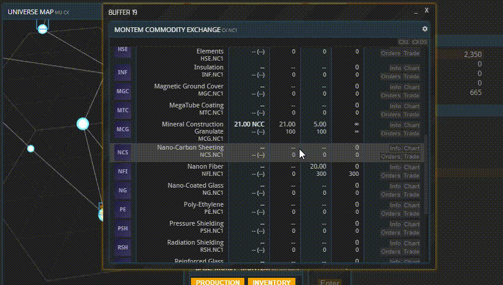

You now have everything you need to build your Production Line(s) and your workers’ quarters. However, your workforce needs to be fed in order to become active. Which workforce you have depends on the Habitation Module you bought – in all likelihood, you are starting off with a Hab 1, which fits 100 Pioneers. Hitting the Population button in your Base buffer will show you the requirements per 100 workers of each tier. Pioneers need 4 units of Drinking Water every day.

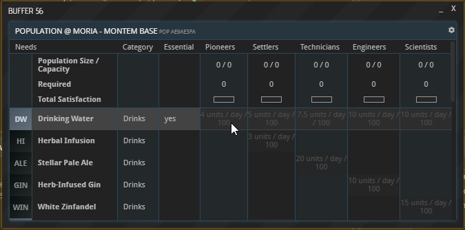

You were supplied with Rations and Drinking Water when you started. If you want to buy some more right away, go ahead. They can be found in the Commodity Exchange’s drop-down menu under “Consumables”. Make sure to not spend all your money on them.

## Part 3: Participating in the Market

### Buying Input Materials

The last thing you might need to buy now is Input materials for your first Production Line. (“Production Line” is simply another term for one type of building that produces goods, like, for example, the Prefab Plant 1. All Prefab Plants 1 in a base, be it one or many, will make up one Production Line.) Input materials are commodities that are processed into another commodity in your Production Line. If your first Production Line consists of buildings found in the “Resources” tab, it doesn’t require any Input materials. Many buildings in the Pioneers tab, however, take Input materials. Hit the “Construct” button in your Base overview again, find the building you just bought the construction materials for, and click its symbol. The “Products” section shows which commodities can produced here and which Input materials, if any, are required for that to happen. Think of each of these lines as a chemical reaction: everything left of the arrow - the input materials - goes in, the product on the right comes out. Later, when the building has been constructed in your base, you will be able to choose which of these reactions you want to happen every time you produce something.

Which output should you produce? To make that decision, have a look at the Commodity Exchange and check what people are buying. Is there anything everybody needs right now or that people will need soon? Or some shortage you could profit off? You can also ask around in the public communication channel. If you are just getting started, you usually cannot go wrong with the following: Farms should start off with Grains, the Food Processor should focus on Rations first. The Extractor’s output depends on the planet, and owners of Smelters can just buy that output and smelt it down.

Now go ahead and buy whichever Input materials you require for the desired output. It is possible that you don’t get all the Input materials you want right now. See which ones are already available, start producing what is possible, and check back soon for anything you might not have gotten. Especially if your section of space has just recently been settled, the market might take a while until more refined commodities such as Steel become available.

Now, we might have a little present already waiting for you aboard your ships. In the Fleet window, click their transponder codes and cycle through to their cargo holds. You will find Rations, Drinking Water, and possibly some input materials we thought you might need based on the Package you picked. Open your base’s Inventory in the Base overview screen as shown below and then drag and drop the goods into it. 

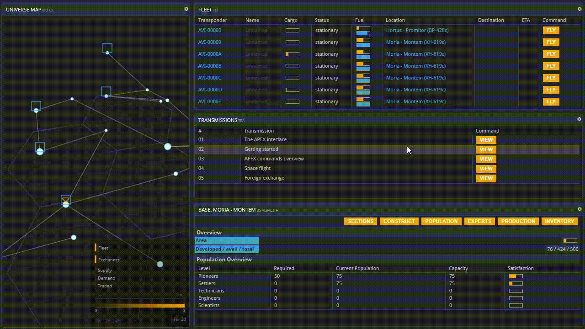

If you cannot see the goods you purchased earlier in your Inventory, it might be that they're also on one of your ships. Search their cargo holds and drag the commodities into your base as well.

### Contracts

If all the items you bought are now in your base's Inventory, you may omit this next bit and skip right to the topic of constructing your buildings; come back later if you want to learn about contracts.

If the commodities you bought are not in your Inventory yet, you now have to go and get them. This happens when neither your base nor any of your ships are currently located at the location where you made the purchase. The moment you made your first purchase, a contract popped up in the sidebar. (If you cannot see the sidebar, you can toggle it on by clicking “SDBR” on the left.)

Click a contract ID to see more information. Alternatively, you can open a list of your contracts by using the “CONTS” command. Next, click “view” to open the details of a contract, and you will see that the units you ordered have been reserved for you and are awaiting pick-up. The button labeled “Fulfill” is greyed out because you have no ship at the location to pick the cargo up with, so you have to send one.

You are now going to learn the exact steps required to pick up your cargo. For more extensive information on the subject of space travel, check out the [Space flight tutorial](../space-flight). If your Fleet window is not open yet, bring it up now using the FLT command shortcut in the left sidebar, then open one of your ships’ cargo holds by clicking its cargo space. Note that a ship’s cargo space is limited, and for bigger purchases it might be necessary to send multiple ships. Your cargo hold is limited by the available space (in cubic meters) and maximum weight of its contents.

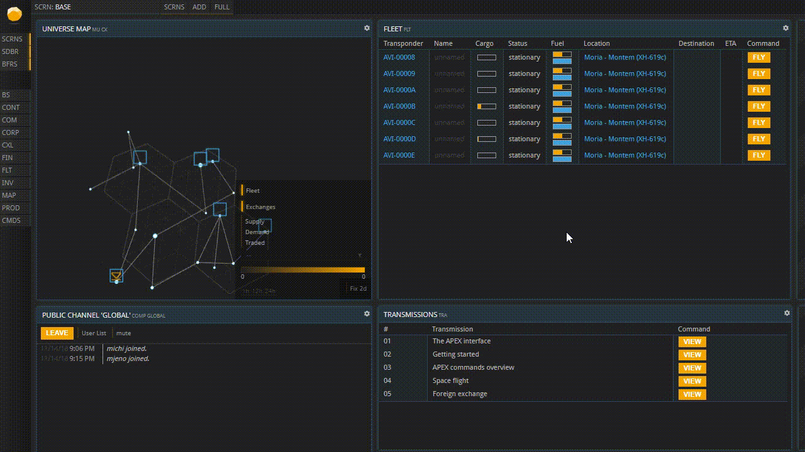

In the Contract buffer that opens up, you can see the target planet’s ID:

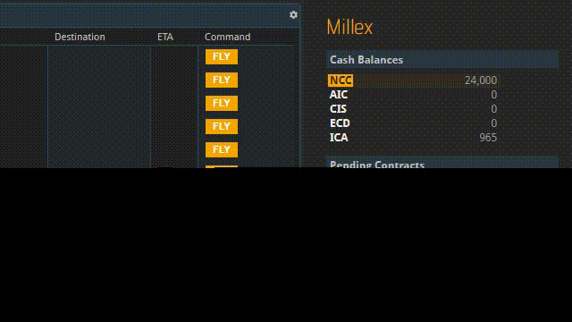

Now hit the “FLY” button next to its entry in the Fleet window to bring up the Ship Flight Control. Copy the target planet's ID into the Flight Control’s Destination field and then set the fuel usage. The higher the fuel usage, the sooner your spacecraft will arrive, but setting it to one-hundred percent means that it won’t have a drop of fuel left to return home and the trip would be unreasonably expensive. Note that, depending on the distance of your trip, you may not be able to spend 100 % of your fuel.

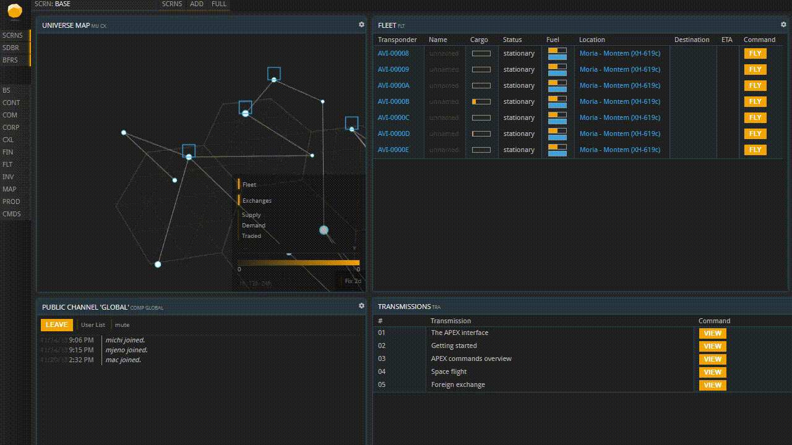

In any case, the flight will take several hours during which you cannot do anything but wait. Your ship’s position is tracked in the System Map and Universe Map as a yellow triangle. If you do not see it, toggle on “fleet” in the bottom right corner.

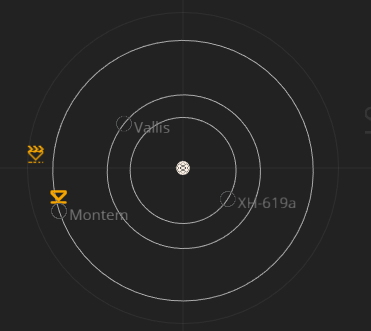

Your fingers are probably itching to explore more of APEX right now, but space is vast and real work takes time. That is why, for better or for worse, waiting is part of the APEX experience. However, as your business grows, you will have more and more things to do while waiting for other processes to finish.

Once your ship has arrived, the Fulfill buttons of the active contracts you have at your target location will turn green. If they don’t, the reason might be that the target market is on the planet surface and your ship is still in orbit.

To fix that, select the ship’s FLY button in the Fleet window again, enter the ID of the planet it is orbiting, check “Planetary landing” and select “START” once more.

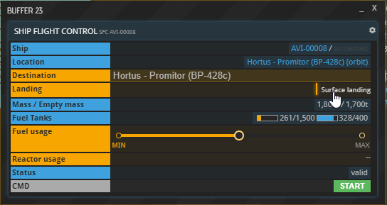

By now, the “Fulfill” buttons on the active contracts you have on that market should have turned green. Click them to load up your ship with the goods you purchased and send it home the same way you sent it out before. Once it arrives at your home base, make sure to drag and drop the materials you purchased from its cargo space into your Base’s inventory.

### Constructing Sections

With all the commodities you bought now in your base, it is finally time to set up your buildings. Hit the “CONSTRUCT” button in your base overview to find the buildings you bought the materials for.

If you find that you cannot construct a building, you are still missing some of the required materials. Go back to “Buying Commodities” above and buy what's missing.

_As you can see, 2 BSE are missing, which is why “BUILD” is greyed out_

Set up the living quarters first. As established, you most likely need Pioneers to operate your first Production Line, for which you need to create a Habitation Module 1. Once you construct it, the building arrives on your planet immediately, fully loaded with one-hundred Pioneers ready for work.

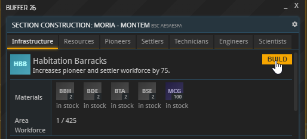

Next, construct the the Production Line you decided to build.

After you did, open the Sections buffer to check if your new buildings are already listed. In the Population buffer, you can now also see your workforce of (presumably) 100 Pioneers. They are currently fully satisfied because you have are providing them with Rations and Drinking Water. You can see that Pioneers only need those two consumables to survive, while more specialized workers have higher and higher requirements to function properly. That is why, before creating a Section that requires a higher-level workforce in the future, you should make sure you are going to have regular access to a sufficient amount of the consumables required by that workforce, like Basic Medical Supplies, Protein Paste and Beer for Settlers.

### Placing Production Orders

The last thing you need to learn now is how to place Production orders. (Do not confuse them with Buy orders and Sell orders made on Commodity Exchanges.) Right now, your workforce is idle and awaiting your commands.

Bring up your Production Lines by selecting “Production” in the Base overview. You should see the name of whichever building you just constructed and an array of empty boxes underneath. Those boxes can be filled with orders by selecting “New Order” right above them (or via “Details” - “New Order”). The PRODCO buffer, which now opened up, lets you choose which commodity you would like to produce. As established, some buildings can only produce one commodity, while others offer a wide variety of choices in the dropdown labeled “Primary Output”. You can also see here which Input materials are required for which output. Remember that you already decided what to produce earlier, when you bought your input materials.

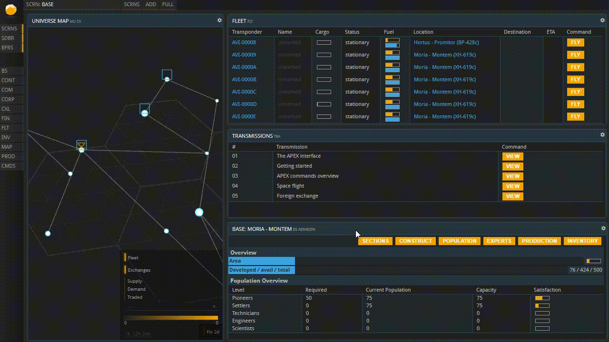

You can always produce one type of commodity per order. Once you selected it, set the Order Size. The higher it gets, the longer the order will need to process and the more input materials will be required. You will find that this is very handy. If, for instance, you know you cannot check back with your company for a while, just set it to a high value, and your workers won’t run out of things to do while you are gone. Start processing the order by hitting “QUEUE ORDER”, and it will show up in your Production Lines window. If you are not missing any input materials, it is now being processed, and you will be able to track its progress and the time remaining. Send out more orders until your queue is filled up. You can pick a different output material for every order as you desire. Once queued, an order can be canceled by selecting “Details” below your Production Line and then “Cancel” next to the order. Once an order is being processed, it can no longer be canceled.

### Final Words

That is all you need to know to get your company off the ground. Contrary to what you might be thinking now, you have just scratched the surface of things you can do in APEX. Throughout the next few days and weeks, placing buy and sell orders, observing the market, coordinating with other licensees and making cargo runs with your ships will become second nature to you before you know it. When you are ready to get into more advanced topics, like Foreign Exchange or Faster Than Light travel, continue with more tutorials.

## More tutorials

* [APEX overview](LINK)  
* [Space flight](LINK)  
* [Foreign Exchange](LINK)  
* More to come!

Use the arrows below to cycle through all available tutorials in order, from introductory to more and more specific topics.