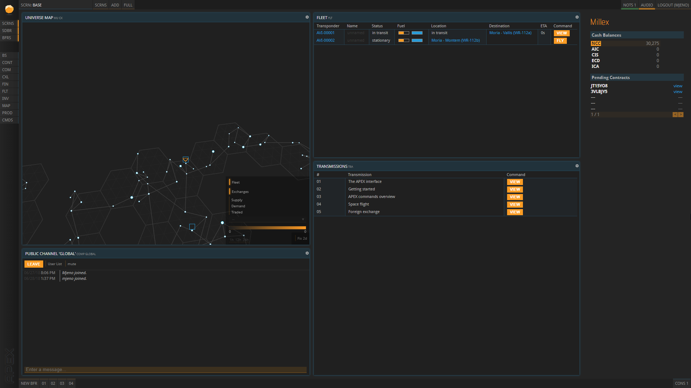
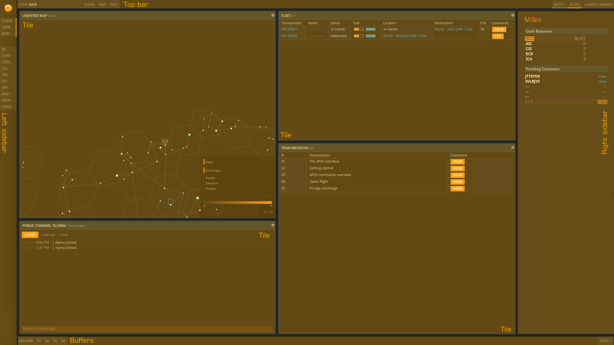
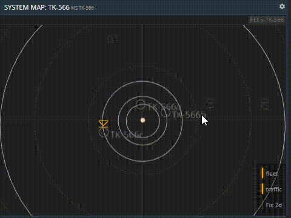
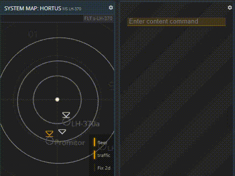
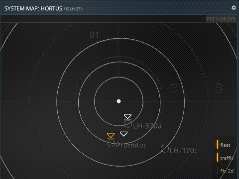
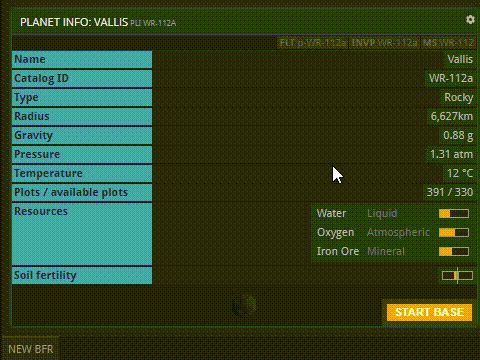

本指南也有视频版本。点击下方观看视频，或向下滚动查看文字版本。



## 概览

本教程将向您介绍APEX界面（以下简称"APEX"）及其基本组成部分。首次打开APEX时，它看起来是这样的。

它的布局和内容高度可定制，以满足您公司的特定需求。然而，其基本组成部分始终相同。

## 面板

面板是APEX中最支持自定义的部分，因为您可以决定要查看多少个面板，它们显示什么以及它们在屏幕上的分布方式。面板会显示您感兴趣的大部分信息，例如宇宙、恒星系、行星、您的基地、建筑、生产力、历史购买记录等等各类概览。

您可以对面板做很多操作。拖放面板的边缘以调整大小。

将鼠标悬停在右上角的图标上以获取更多选项。  

您可以删除一个面板，相邻的面板将自动扩展。  

您可以删除面板的内容，也可以将其水平或垂直拆分来创建空面板。  

您可以通过拖放另一个面板来覆盖空面板。  

## 缓存窗口

缓存窗口是未固定在屏幕布局中的面板。它们可以被自由拖动。虽然固定的屏幕布局是您的主要工作区，但缓存窗口可以用于短期用途，并可以快速关闭或最小化。即使在多个布局之间切换时（见下文），缓存窗口也会在屏幕上方保持打开状态。

底部的栏类似于任务栏。它显示了当前打开的缓存窗口。点击"新建缓存窗口"或按下Ctrl + 空格键打开一个空缓存窗口。通过使用命令（见下文）或将另一个缓存窗口或面板的内容拖放到其上来填充内容。

（右下角的"xx人在线"按钮与缓存窗口无关。点击它将显示所有当前连接用户的列表。）

## 命令

乍一看，这个功能可能令人生畏。您可以完全不使用命令来使用APEX，但随着的游戏过程，它们会派上用场。命令的作用是直接跳转到所需内容，而不是通过点击一系列链接。每个面板和缓存窗口，即使不是您通过命令打开的，都对应着一个特定的命令。您可以通过清空面板内容来查看面板的命令。

命令应输入到空白面板的命令行中。"CMDS"命令会打开所有现有命令的列表。要了解更多它们的使用方法，请查看[命令](../commands)教程。如果您正在寻找特定的命令，请参阅[命令](../../wiki/commands-list)列表。

## 左侧边栏

左侧边栏显示三种不同的信息。顶部是我们的Logo——APEX之石，它不仅仅是个装饰。在正常情况下，它保持静止。如果它旋转起来，就说明有东西没有正常工作。在这种情况下，重新加载APEX应该能解决您的问题。重新加载后，请确保您上次的操作已被正确处理。

下面的三个按钮可以切换其他侧边栏的显示或隐藏。

在它们下方，您可以找到几个常用命令的快捷方式。点击它们会打开一个缓存窗口，显示相应的内容。通过使用这些快捷方式，您可以避免自己输入命令。此处未链接的命令可以通过打开相关命令并通过点击访问所需内容来替代。例如，您可以在此处（MAP）打开宇宙地图，然后从那里选择一个恒星系，然后点击一个行星。这里每一个操作都会自动输入正确的命令。

## 右侧边栏（SDBR）

右侧边栏显示您所有现有货币的账户余额以及您的待处理合同。后者对本篇介绍并不重要。

## 顶栏

顶部的栏显示当前打开的是哪个屏幕布局。在下面的示例中，它是一个名为"导航"的布局。将鼠标悬停在"界面"上会打开所有现有布局的列表。默认情况下，会有一个已经设置好的名为"FINANCES"的界面。点击界面名称将打开它。

点击"添加"会打开创建界面缓存窗口，您可以在这里从头开始设置新界面并为其命名。"全屏"按钮将设置APEX为全屏模式。

请记住，任何界面的任何面板都可以同样存在于其他界面上。如何组织您的APEX界面完全取决于您。要将信息从一个界面转移到另一个界面，只需在缓存窗口中打开它。缓存窗口不与特定界面绑定。

在右侧，您还会看到另外三个元素：点击"通知"将打开您的通知，通知您某个流程何时完成。一旦您收到新通知，此处会闪烁绿灯。
"音频"是一个切换按钮，允许您启用或禁用新通知附带的提醒音效。
"登出"按钮允许您退出登录。您无需每次关闭APEX时都登出。如果您在私人电脑上工作，可以随时保存登录状态。

## 关于本页

本页是入门教程的一部分，包含第1部分和第2部分（2.1-2.5）。使用两侧的箭头按顺序浏览可用教程，从入门到越来越特定的主题。

如果您遇到错误或找不到问题的答案，我们很乐意在我们的[Discord](https://discordapp.com/invite/G7gj7PT)服务器上为您提供帮助。