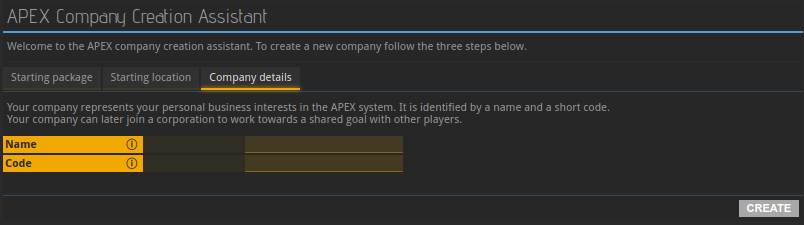

An __older version__ of this guide is available in video format. __Click below to watch the video or scroll down for the written version.__



When logging into APEX for the very first time, you are greeted with a screen containing three tabs: Starting package, Starting location, and Company details. You can go back and forth between those tabs until you are satisfied with your choices. _Please make use of the many information icons, each of which will provide more details about a line when hovering over it._ To further assist you in choosing a good combination of faction, planet and package, we have set up [this page](../../wiki/packages-factions). You may open it separately now and use it as a reference while going through this tutorial in order to make the most informed decision.

### Starting package

In this tab, APEX wants to know what kind of company you will be running, i.e. in which supply chain you will be operating. This will impact which resources you will be provided by the APEX program to help build your structures in the beginning. It will also determine which type of experts will be made available to you. Changing your profession at a later point in time, while entirely possible, is going to take time. The choice you make now will impact your company’s direction for a while. Cycle through the different packages using the yellow arrows and move on to the next tab when you've made your choice. If you need help making up your mind, you may read more about packages [here](../../wiki/packages-factions/#packages).

### Planet & Faction

The next step is picking the starting location of your fleet. Most entries available to you are planets, which are strongly recommended to newcomers, but some may be space stations. Starting on a station means that you will need to fly to a planet in order to set up your base.

The commodity exchanges shown in the bottom right are the places where goods can be traded with others; unless a commodity exchange is directly on your planet, you will be required to send ships in order to buy or sell wares. This means that trading gets more expensive due to shipping costs, and that it takes more time. Skip through the commodity exchanges to see their respective distances to the currently selected planet. "On planet" means that you will be able to directly trade from your base. "In system" means that the selected exchange is on another planet or space station in the same system as the selected planet. If a number of jumps is being displayed, the planet and exchange are that many systems apart.

_Newcomers should generally avoid settling on planets without a commodity exchange in the same system. If your planet of choice does not have a commodity exchange nearby, the information in these tutorials might not be in the right order for you._

In the bottom left of the second tab, you can see which faction controls the currently selected planet. Although all factions peacefully coexist and will not harm you if you want to trade in another faction’s territory, each of them has their own currency. Your starting balance will be paid in your faction's money; in order to trade in another faction's space, you will need to obtain their currency first on the foreign exchange market.

### Company name & code

In the final tab, you are asked to provide the name and code of your company. The name you choose must not violate APEX’s terms of service, meaning that it must not be offensive or too similar to the name of an already existing company. Next, you get to choose the company code, which is an abbreviation, an identifier used for looking up your company within APEX. It must be three to four letters long and, like the company name, it needs to be unique.

## 关于本页

本页是入门教程的一部分，包含第1部分和第2部分（2.1-2.5）。使用两侧的箭头按顺序浏览可用教程，从入门到越来越特定的主题。

如果您遇到错误或找不到问题的答案，我们很乐意在我们的[Discord](https://discordapp.com/invite/G7gj7PT)服务器上为您提供帮助。