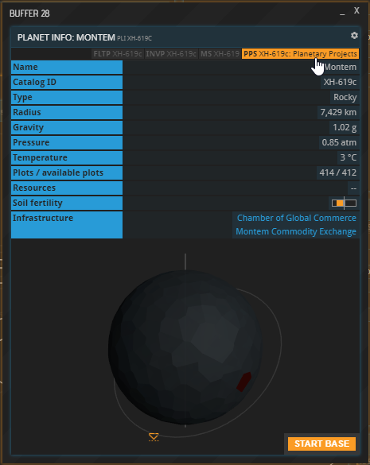
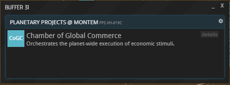
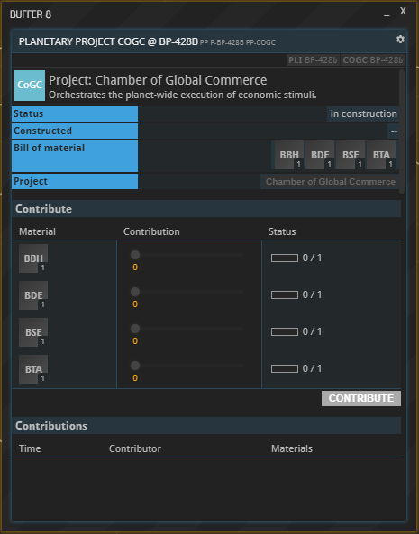
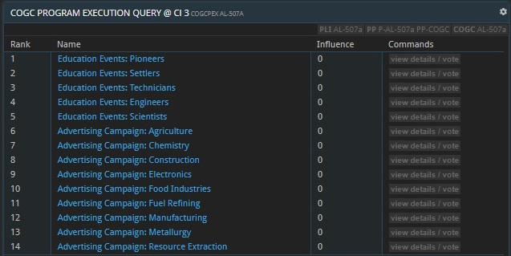
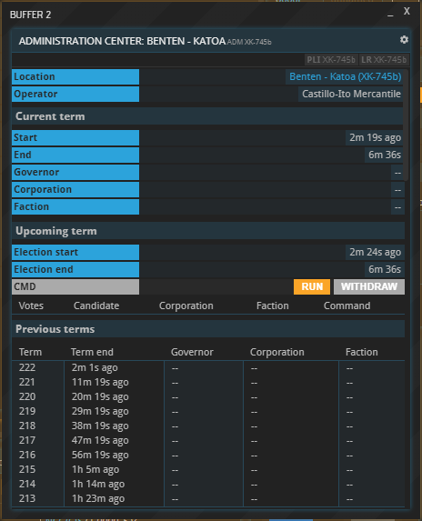
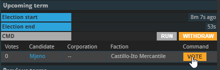
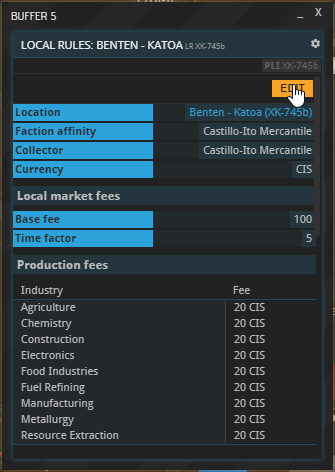
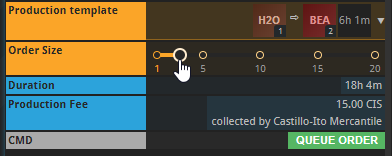
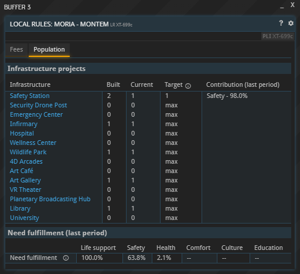

---
title: "6. Planetary Projects"
date: 2018-09-18T17:13:49+02:00
weight: 10
---

{}
This guide is also partly available in video format. __Click below to watch the video or scroll down for the written version.__
{}



## Introduction

Planetary projects are collectively erected and maintained structures that provide a bonus or service to the inhabitants of a planet. If projects are present on a planet, they will be listed under “Infrastructure” in the `PLI` as well as the `PPS` command (accessible at the top of the `PLI` command).

Clicking “details” next to an entry in the `PPS` window will reveal more information on that project.

## Building a planetary project

New planetary projects can be initiated by anybody with a base on the respective planet. To do so, open the planet’s `PPS` window and select “contribute” next to the desired planetary project.

In the new project window - the project being a CoGC in this example -, you can track the cost of building the project, the progress that has been made towards its construction, and the individual contributions made by inhabitants of the planet. Use the sliders to select the size your contribution.

Once all contributions have been filled by the planet’s inhabitants, the finished project will become visible as a green plot on the planet. Clicking the plot will open a new buffer about the project.

## Planetary project types

Once built, a planetary project might require a regular upkeep to stay active. As long as the upkeep is not being paid, the project remains “on strike” and provides no bonuses. Similarly to the construction of a planetary project, contributions towards its upkeep can be made by anyone residing on the planet in question.

To contribute, open the project’s buffer by clicking its name under “Infrastructure” or its plot on the planet (in a PLI window). Under “Upkeep”, select “contribute”. In the new window, set the slider(s) to the desired amount and hit “CONTRIBUTE”. Your contribution will be listed at the bottom along with all other recently made contributions.

### Chamber of Global Commerce (CoGC)

A Chamber of Global Commerce can run a variety of programs to stimulate a planet’s economy. Open the buffer of a CoGC by clicking its name under “Infrastructure” or its plot on the planet (in a PLI window). In the new CoGC window that opened up, you can see the CoGC’s current and upcoming programs listed under “Programs”.

#### Voting for Programs

To vote on the upcoming program, select “programs / vote”, which opens up a list of all available programs. Note that only those which are operating under an APEX [PRO License](https://prosperousuniverse.com/premium) can cast a vote.

Click a program’s name or the respective “view details / vote” button learn more about it. Hit “Vote” to give your vote to the desired program; the one with the most votes will be listed as the upcoming program in the planet’s COGC buffer.

Votes are not equal, but instead depend on the voting company's influence, which in turn depends on the size and composition of their work force. Each _individual worker_ grants influence; a pioneer grants 1 influence, and hence 100 pioneers grant 100 influence. Higher tier workforces have higher multipliers:  

| Worker type 	|	Influence multiplier	|
|---------------|---------------------------|
| Pioneer 		| 1							|
| Settler		| 1.25						|
| Technician 	| 1.5						|
| Engineer		| 1.75						|
| Scientist		| 2							|

For example, a company employing 200 pioneers, 100 settlers, and 200 technicians has an influence of 200 * 1 + 100 * 1.25 + 200 * 1.5 = 625.

#### Upkeep Costs

The CoGC's programs require payment of an upkeep cost in the form of materials to go into effect.  

The materials required as upkeep are DW, MCG, PE and RAT.  The total amount required of each material in upkeep is determined by the number of player bases on the planet multiplied by the material multiplier.  The multipliers are 3x for DW, 4x for MCG and PE, and 2x for RAT.  The minimum upkeep cost of five times the multipliers is used until a planet has enough bases to surpass it.

### Local Markets

Local Markets are a means for exchanging goods outside of Commodity Exchanges. Due to their important role in the economy, please refer to [this dedicated tutorial](../local-markets) on how they are used.

### Warehouses

As of the release of the Presence update, you are allowed to rent warehouses on planets regardless of having a base there or not. Warehouses are used to store commodities and function as a normal storage unit; they can be especially useful when trading with other players. 

Warehouses can be accessed via the `WAR` command followed by a planet identifier or via the infrastructure section of a planet's `PLI` command. Each company can only rent a limited amount of storage units that depends on the level of the warehouse. The weekly rental fee is controlled by the local governor and thus varies from planet to planet. If the rental fee cannot be paid the inventory will be locked and its contents will be inaccessible.

Warehouses can be extended up to level 20. The cost of each extension is a multiple of the original costs (cost factor below). The total amount of available units and the amount of units available to a single company increases with each level:

| Level | Cost factor | Available units | Rentable units |
|-------|-------------|-----------------|----------------|
|     1 |           1 |              50 |              1 |
|     2 |           1 |             150 |              1 |
|     3 |           2 |             300 |              2 |
|     4 |           2 |             500 |              2 |
|     5 |           3 |             750 |              3 |
|     6 |           3 |            1050 |              3 |
|     7 |           4 |            1400 |              4 |
|     8 |           4 |            1800 |              4 |
|     9 |           5 |            2250 |              5 |
|    10 |           5 |            2750 |              5 |
|    11 |           6 |            3300 |              6 |
|    12 |           6 |            3900 |              6 |
|    13 |           7 |            4550 |              7 |
|    14 |           7 |            5250 |              7 |
|    15 |           8 |            6000 |              8 |
|    16 |           8 |            6800 |              8 |
|    17 |           9 |            7650 |              9 |
|    18 |           9 |            8550 |              9 |
|    19 |          10 |            9500 |             10 |
|    20 |          10 |           10500 |             10 |

### Administration Center

The AC allows you to hold elections for a planetary governor, who can set taxes and fees. Only planetary residents are eligible to vote, but anyone can run. Each term is two weeks long.

Once erected on a planet, the building will be listed as the “Planetary Administration Center” under Infrastructure in the PLI window. Clicking the entry will open the ADM window, which lists information on the current governor and the next election. The governor's Corporation and Faction are important because one of them always collects the total local fees paid by the planet's residents (see below).

#### The Election Campaign

The current candidates for governor are listed at the bottom of the upcoming term section. Select the VOTE button next to your favorite candidate to cast your vote.

If you'd like to run for governor, select the RUN button below the list to throw your hat in the ring. All residents of the planet will be notified about the outcome of the election.

#### Being the Governor

**NOTE:** Recent updates changed the process of how political actions are handled. Bigger planets are now ruled by parliaments instead of solo governors. In any case though, to manage political actions you now have to switch to the respective **government context** (via CTXS at the top of the screen), and then issue **motions** via the `MOT` command. These will be voted upon by all government members and then, if the motion passes by majority decision, the included actions ("components") will be executed.

If you won the election, you may now set the fees that apply on your planet until the end of your term. To do so, bring up the LR window of your planet (e.g. by selecting it at the top of the ADM window). It will show the current fees and feature an EDIT button at the top.

Clicking it will allow you to change the metrics shown below. Note that certain restrictions to the rules apply within faction-space, i.e. on the starting planets and other planets in their systems. 

**Currency:** The currency in which the fees must be paid. Within Faction space, this will always default to the local Faction's currency. Otherwise, it will be the currency of the selected fee collector (see below).

**Fee collector:** This drop-down allows you to select which entity will receive the collected fees by means of a weekly dividend payout, currently every Monday. Your choice is between the Corporation you are a member of (if applicable) and a Faction.

If you select your Corporation, the money will be distributed among all members according to the shares they own. If, for example, a member owns 50% of a Corp's shares, they will receive 50% of the dividend payouts. The dividend's currency will be the same as the collected fees, regardless of the Corporation's default currency. Your Corporation's past payouts and a countdown to the next one can be viewed in the CORPFIN buffer.

Which Faction you are able to select depends on whether the planet is in Faction space, in which case the ruling Faction can be selected – or not, in which case you may select the Faction you yourself belong to (i.e. the one determined by your original starting planet). Select the desired entity and hit UPDATE below to lock in your choice.

**Local Market fees:** This section allows you to impose fees on the planet's [Local Market](../local-markets) (if there is one). The base fee denotes the up-front cost that residents have to pay to place an ad on the Local Market. The time factor determines what the ad will additionally cost them per day. For instance, setting the values to 100 CIS and 5 CIS respectively will put the total price of an ad running for five days to 125 CIS. Note that both values are limited in faction space; in the example shown above, the limits are 50-150 for the base fee (the value left of the forward slash) and 3-8 for the time factor (after the slash).

**Production fees:** You may set different [production](../production) fees for each industry and workforce tier here. The fee limits depend on whether your planet is in faction space. Additionally, more advanced workforce tiers have a higher upper limit. Production fees are collected when a production order is placed in any production line on the planet, and they scale linearly with the order size. Fees for buildings using multiple different workforce tiers are calculated via a weighted average depending on the composition of the overall workforce. The amount and collector of the fee are listed near the bottom of every PRODCO window as shown below.

*Local Market fees and production fees can only be changed a combined 5 times per term.* The UPDATE button at the bottom locks in your changes for both of them, the figure above it shows how many more changes are possible.

#### Population Settings

In the "Population" tab of the LR window, you can find a set of options and information regarding the [planetary population](../planetary-population).

**Infrastructure projects:** You can see a list of all [population infrastructure](#population-infrastructure) projects alongside the level that has been built by players on the planet, the currently active level and the target level. As the governor, you can set the latter yourself. Each population period, starting with a new population report, the current level will be set to the target level you selected (or the built level if you select "max"). This means you can run infrastructure below the maximum available level, for example if your population currently doesn't need the full need satisfaction and you don't want players to "waste" more upkeep materials than absolutely necessary. The rightmost column can help you make these decisions as it will show you how much each project contributed to a need's total satisfaction last period.

**Need fulfillment (last period):** This section gives you an overview of last period's total need satisfaction levels to make it easier to gauge whether you need to upgrade certain kinds of infrastructure or raise their target levels.

#### Government Programs

In the "Programs" tab of the LR window, you can start political programs that will grant the planet a specific benefit for a certain time. Programs have a cooldown period of one week, so you can only run one program per week. If a program is active when the planet's [population report](../../tutorials/planetary-population#happiness--growth) is generated, it will affect this report's numbers.

**Types of government programs:**
* **Immigration:**: Add a certian number of workers of the chosen tier to your planet's population.
* **Family Support:** Increase the growth of your PIO, SET and TEC population by a certain percentage.
* **Education:** Increase the rate of workers leveling up to a higher tier by a certain percentage. 
* **Festivities:** Increase the overall happiness of the planet's population by a certain percentage.

You can check the details of a program's effect and its costs when you select it in the programs tab before activating it.

### Population Infrastructure

The "Population infrastructure" project does not have to be built and exists on all planets by default. Opening it will show you a list of  all the planetary projects that serve to satisfy the planetary population's needs. Find out more about planetary populations in the respective [section](../../tutorials/planetary-population) of the tutorial.

### Shipyards

Planetary shipyards allow you to construct new ships from your own blueprint designs. Find out more in the respective [section](../../tutorials/shipbuilding) of the tutorial.

## About this page

This page is part of the advanced tutorial series. Use the arrows on the sides to cycle through all available tutorials in order, from introductory to more and more specific topics.

If you encounter an error or cannot find the answers to your questions, we will gladly help you on our [Discord server](https://discordapp.com/invite/G7gj7PT).
