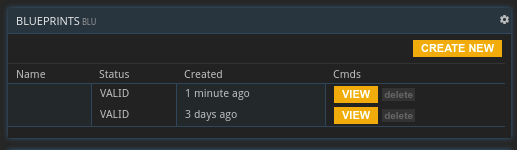
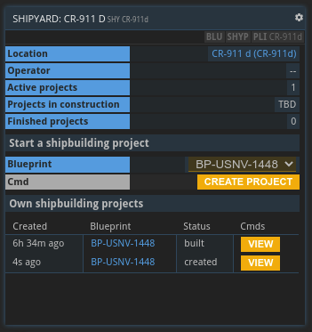

## Overview
While each player starts with a small set of relatively simple ships, custom ship designs can be created in the form of blueprints. Those blueprints can then be used to start shipbuilding projects at planetary shipyards. Filling the material bill for a blueprint will create a new ship with the specified components and performance metrics to join the player's fleet.

## Blueprints

Custom ship designs are stored as blueprints. With the BLU command you can open a list of all your blueprints to view and edit them or create new ones. Creating a blueprint (or viewing an existing one) brings up the blueprint design buffer shown below.

The blueprint design buffer consists of 3 major parts:
* __Layout:__ This is where you design your ship by picking specific components from the drop-down lists in all the categories. The blue categories at the bottom are required components that will automatically be selected based on your current configuration.
* __Performance:__ Here you can find a quick overview of your ship's most important performance metrics, such as cargo capacity and speed.
* __Bill of material:__ This is where you can see a preview of all the materials that will be required to construct an actual ship from your blueprint at a shipyard.

### Ship Parts

The following ship parts (some of which are entirely optional) can be selected from multiple options via the drop-down menus:

* __STL Engine:__ Affects the ship’s thrust, i.e. maximum acceleration during STL flight, and its rate of STL fuel consumption.
* __FTL Reactor:__ Affects the ship’s power, i.e. maximum speed gain from overcharging during FTL. More powerful reactors generally take longer to charge. Overcharging a reactor increases the damage taken during FTL flight.
* __STL Fuel Tank:__ Determines how much STL fuel the ship will be able to hold.
* __FTL Fuel Tank:__ Determines how much FTL fuel the ship will be able to hold.
* __Cargo Bay:__ Determines the total weight and volume of commodities the ship can carry.
* __Hull Plates:__ Hull plates differ in how well they shield the ship from damage, the maximum g-factor they can support, as well as their weight. (Note that a _negative_ damage reduction means your ship will take _more_ damage than usual.)
* __Heat Shielding:__ Reduces the damage taken from entering a planet’s atmosphere.
* __Whipple Shielding:__ Reduces the damage taken from STL flight through meteoroid-dense systems.
* __Radiation Shielding:__ Reduces the damage taken from STL flight close to high-radiation stars.
* __Stability Support System:__ Prevents taking damage from landing on planets with unusually high or low gravity.
* __Self-repair Drone Hub:__ Reduces the damage taken from any source.
* __High-G Seats:__ Increases the maximum g-factor the ship can endure, thus increasing its maximum speed during FTL flight.

The following ship parts are automatically selected based on the ship's configuration:
* __Structure:__ The different ship parts are held together by structural components. The larger the ship, the more of those are required.
* __Command Bridge:__ Certain engines and reactors require an advanced MK2 command bridge to be controlled.
* __Crew Quarters:__ Every ship needs a place for its crew to live in. There are several sizes of crew quarters that will be chosen automatically depending on the ship's total volume.
* __FTL Field Controller:__ A required component if the ship is supposed to be able to perform FTL jumps.
* __FTL emitters:__ To perform FTL jumps, the ship needs to create an FTL field around itself. The larger the ship, the more volume its emitters need to span. Charging the emitters takes up some reactor power.

## Shipyards
A shipyards is a type of [planetary project](../../tutorials/planetary-projects) that allows you to construct actual ships from your previously designed blueprints.

A shipyard's buffer allows you to select one of your blueprints from a drop-down menu. You can then start a new shipbuilding project based on this blueprint by clicking "Create Project". At the bottom you will find a list of your previous shipbuilding projects at this shipyard and their status. You can also view more details on each project and continue the building process if it's not finished yet.

A shipbuilding project primarily consists of a big list of materials that you need to provide to start the actual building process. You can transfer the required materials from any local storage (which you can select from the drop-down menu at the top of the materials list). Once the material bill has been filled completely, you can start the building process. After a few days (depending on the size of your ship), your new ship will be added to your fleet (which you can always view via the FLT command).

### Ship Upgrades
The second type of shipyard project is an __upgrade project__.

To initiate an upgrade project, you need to select two blueprints:
* __Origin Blueprint:__ The blueprint of the ship that you want to modify. You can check a ship's blueprint via its SHP command.
* __Target Blueprint:__ The blueprint you want the ship to end up with after the upgrade.

The costs for upgrading a ship depend on the difference between the blueprints you select. You will have to provide all the materials present in the target blueprint that were not already part of the origin blueprint.

When opening an upgrade project in its SHYP command, there will be a dropdown menu to select the ship you want to be upgraded. An upgrade project cannot be started without selecting a ship. Note that to be able to select a ship in the first place, it needs to be __present at the shipyard's location__.

To actually start the upgrade process, the ship needs to also fulfill the following criteria:
* The ship's blueprint needs to match the origin blueprint of the project.
* The ship's inventory as well as its STL and FTL fuel tanks need to be empty.
* The ship cannot already be used in another ongoing upgrade project.

Once you start an upgrade project, the selected ship will be locked until the upgrade is completed. This means its stores cannot be interacted with and it cannot start a flight.

## Ship Damage

Note that your ships will take attrition damage from several factors:
* __STL/FTL Flight:__ Whenever a ship is in STL or FTL flight, it will take a small amount of damage over time. This kind of damage can be reduced by using more sturdy hull plates.
* __FTL Overcharge:__ You can decide to overcharge your FTL reactor for faster FTL jumps. This deals additional damage to your ship.
* __Heat:__ Entering a planet’s atmosphere (specifically in case it's one of high pressure) puts enormous stress on a ship's hull in the form of heat. Heat shields reduce the resulting damage.
* __Gravity:__ Gravitational forces weaken the internal structure of a ship during take-off and landing. A stability support system prevents this.
* __Radiation:__ The harsh radiation of a sun during FTL flight, especially when close-by, weakens the ship's hull. Radiation plating reduces this type of damage.
<!---* __Micrometeoroids:__ On STL flights between planets a ship will get hit by micrometeoroids. The exact damage depends on the density of micrometeoroids in the systems you're traveling through. Specialized whipple shields reduce this type of damage.-->

Ships below a condition of 80% start to become slower. You can repair a ship from its SHP command. This will require a certain amount of hull plates as well as shield and structural components depending on your ship's condition.

## About this page

If you encounter an error or cannot find the answers to your questions, we will gladly help you on our [Discord server](https://discordapp.com/invite/G7gj7PT).