This guide not yet available in video format.

## Introduction

{}
Please note that all usage of Local Markets requires the possession of a [PRO License](https://prosperousuniverse.com/premium)
{}

Local Markets are a [Planetary Project](../planetary-projects), which means they can be built collectively by the inhabitants of a planet. If you want to (help) build one on your planet, please refer to [this guide](../planetary-projects/#building-a-planetary-project).

Once built, a Local Market will be listed under a planet's infrastructure:

Clicking the entry will open the following buffer. This is where you will be able to see existing ads and post your own:

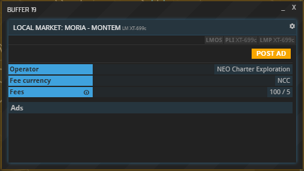

## Trust Ratings

Companies trading on Local Markets have a rating which signals to other parties how likely they are to uphold their end of a deal. Companies are *Unrated* ("U" symbol) by default; a rating can be obtained by acquiring a [PRO license](https://prosperousuniverse.com/premium). Once a company is rated, its rating status will be *Pending* ("P" symbol). Abiding by contracts will result in a higher rating, breaching contracts will lower it. Ratings go from F (worst) to A (best).

A company's rating can be seen using the `CO` command:

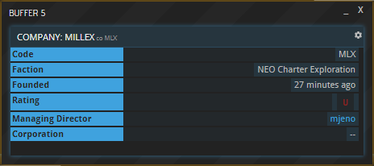

## Placing And Accepting Ads

As an alternative means for exchanging goods, Local Markets come with their own set of advantages and disadvantages. In essence, they work like bulletin boards, which results in a few key differences to Commodity Exchanges:  

* To place an ad, you must be an inhabitant of the planet where the market is located. However, ads can be accepted by anyone (with a PRO license).  
* Offers on Local Markets list their total cost, not the cost per item.  
* Placing an ad costs money. The longer it runs, the more expensive it is.  
* Local Markets do not have Price Bands, meaning that prices can be set freely.  
* You can respond to any ad rather than being restricted to the cheapest offer.  
* Ads on Local Markets always pertain to a certain amount of commodities (e.g. 100 MCG) and cannot be partially filled.  
* Responding to an ad will never automatically result in a transfer of goods, but create a contract instead.  
* Both parties can decide not to uphold their side of a contract made on a Local Market.  

### Example: Placing a Buying Ad

To place an Ad, first hit "POST AD" and then select the "BUYING" or "SELLING" tab in the overview pictured above, which will open this buffer:

In this example, we are placing a Buying Ad, but Selling Ads work exactly the same. While filling out the form, please note the following:

| Field				| Remarks 																							|
|-------------------|---------------------------------------------------------------------------------------------------|
| Commodity	   		| Start typing the name or abbreviation and select the desired commodity from the list. 			|
| Amount	   		| How many units of the commodity you would like to purchase/sell.									|
| Currency	   		| The currency you / your trade partner will use to pay for the order.	   							|
| Delivery Time		| Deadline (in days) on the commodity's delivery and payment after the offer was first accepted.	|
| Ad visibility		| Duration (in days) for which your ad will be visible. A higher duration results in higher fees.	|
| Minimum rating	| Minimum trust rating of companies able to accept your offer (see above).							|

Once you are done inputting the desired values, hit "POST":

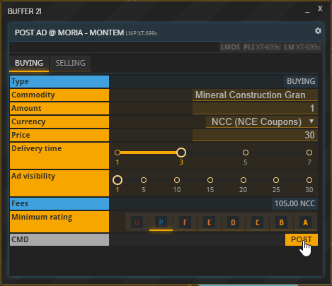

You can now view your ad – and all your other ads – using the **LMOS** command, the Local Market equivalent to CXOS (for Commodity Exchange orders) and FXOS (for Foreign Exchange orders):

Your new ad will also appear in the market overview for the specified Ad visibility duration. Anyone can accept it at any time before it expires, even if they do not own a base on the market's planet:

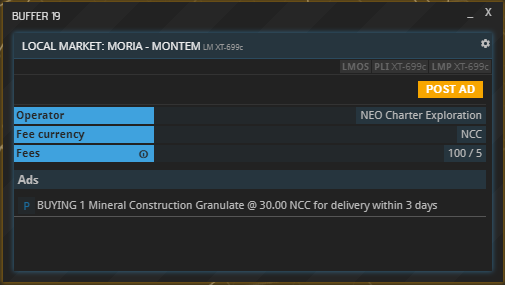

When selected from the list, this is what your ad will look like to a potential trade partner:

Once they accept it, they can view the details and start fulfilling their end of the deal (or not):

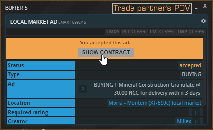

You will receive a notification of your ad having been accepted and a contract will be generated. Just like contracts pertaining to Commodity Exchanges, it will show up in the **CONTS** buffer:

To fulfill your side of the contract, select it from the list and view the details. If you meet the requirements – i.e. own the money owed or have the agreed upon delivery available at the location –, the "Fulfill" button will turn green. Either party can be the first to fulfill their side of the deal.

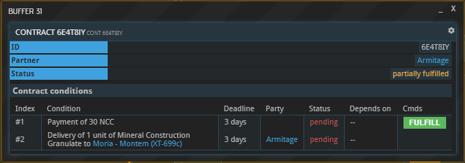

Your partner will see the following equivalent on their end:

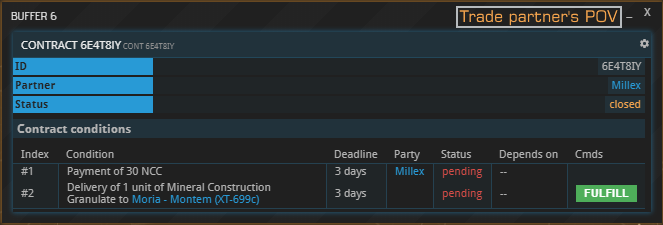

After one side fulfilled their end of the deal, the contract will turn from "closed" to "partially filled". Once both sides delivered, the contract's status will turn to "fulfilled".

### Buying Ads vs. Selling Ads

The example above refers to a Buying Ad. Selling Ads work exactly the same, with one notable difference: Once a Selling Ad gets accepted, the generated contract will contain *three* conditions instead of two. The extra condition (#1) needs to be fulfilled first by the offering party. Doing so will block the specified commodity and it won't be visible in the inventory anymore but still use up weight and volume. Only then will fulfilling condition #3 become possible and its timer will start running, in this case for three days.

Before the seller fulfills condition #1, their partner will only be able to fulfill condition #2, i.e. pay for the commodity:

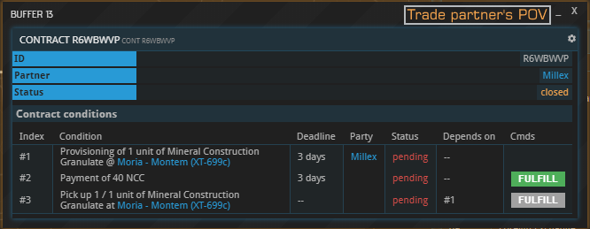

Once condition #1 – depositing the wares – is fulfilled, fulfillment of condition #3 – picking up the wares – becomes available:

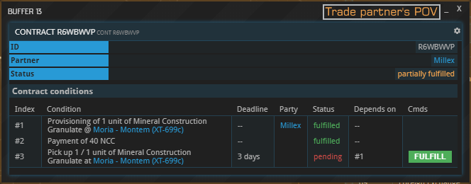

### Example: Placing a Shipping Ad

Shipping ads can be placed using the "SHIPPING" tab which looks like this:

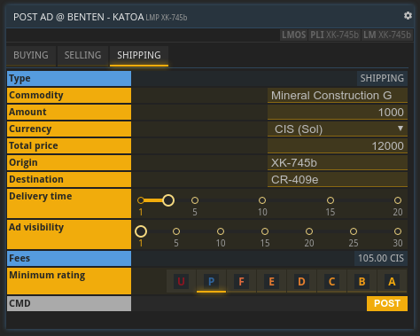

Shipping ads and buy/sell ads have a lot of common fields and there are only two additions:

| Field				| Remarks 																							|
|-------------------|---------------------------------------------------------------------------------------------------|
| Origin	   		| The location where the hauler picks up the shipment                                   			|
| Destination  		| The location where the shipment is delivered too              									|

Shipping ads have to follow two rules to be valid:

1. Origin and destination cannot be the same location
1. Either origin or destination has to be the same location as the Local Market where the shipping ad is being posted

Shipping ads are listed just like the other ad types with the key difference that the content of the shipment is not visible:

 
After the ad has been accepted a contract consisting of four conditions is created. Please note that the contract looks slightly different for the principal and the hauler. The principal will see the contents of the shipment while the hauler will not.

The principal's perspective:

The hauler's perspective:

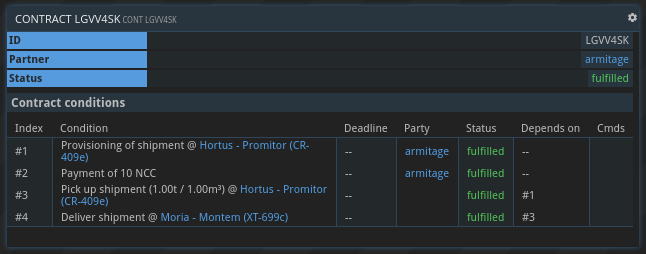

## Breaching contracts

Unlike contracts made on Commodity Exchanges, Local Market contracts can be breached by one or even both sides. A breach always begins with a missed deadline, i.e. not fulfilling one's obligation on time.

If **both sides** miss the deadline, the contract is void. Both sides keep their wares and money, and their companies' ratings are barely changed, if at all.

If **only one company** – company A – fails to fulfill their end of the contract before the deadline expires, their partner – company B – has 24 hours to make a choice: either prolong the contract or mark it as breached.

If they do not react within those 24 hours, the contract will be breached automatically. Breaching it will relieve company A from fulfilling their obligation, but lower their trust rating (see above) in the process. If company B decides to prolong the deadline instead, company B will be granted 24 more hours to uphold their end of the contract. They will of course be notified if this happens:

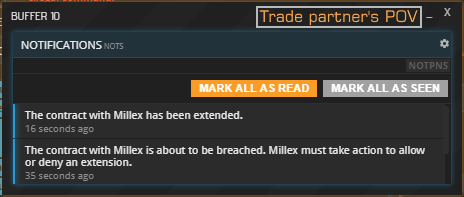

If company A still does not deliver during the extension period, company B will be faced with the same choice again once the deadline is exceeded. It is possible to prolong a contract indefinitely this way, 24 hours at a time.

## Edge cases

Different problems can occur when trying to fulfill a Local Market contract.

### Insufficient inventory space

If company A paid for their commodities, but company B cannot deliver them due to a lack of inventory space on company A's part, the contract system will register that a delivery attempt was made. This will count (almost) the same as an actual delivery towards company B's trust rating, even if the commodities are never delivered.

### Partial payment / delivery

If – for whatever reason – only *part* of a delivery or payment is made before the order's deadline, the party which contributed less to their side of the contract will be considered responsible for breaching the contract. For example, if company B paid 100 % of the price, but company A only delivered 50 % of the goods, company B will be the one to decide whether to extend the deadline or mark the contract as breached by company B. (If the partial delivery is due to insufficient inventory space in company B's base, this will barely affect company A's rating, as described above.)

## About this page

This page is part of the advanced tutorial series. Use the arrows on the sides to cycle through all available tutorials in order, from introductory to more and more specific topics.

If you encounter an error or cannot find the answers to your questions, we will gladly help you on our [Discord server](https://discordapp.com/invite/G7gj7PT).
