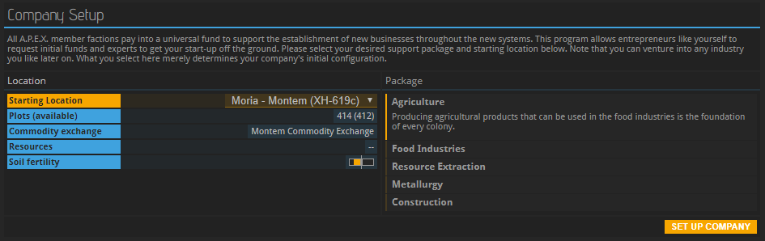

This guide is also available in video format. __Click on the image below to watch the video or scroll down for the written version.__

__To help you choose a good combination of faction, planet and package, we have set up [this page with further information](../../wiki/packages-factions). You should open it separately now and use it as a reference while going through this tutorial in order to make an informed decision.__

### Company name & code

When logging into APEX for the very first time, you are asked to provide the name and code of your company. The name you choose must not violate APEX’s terms of service, meaning that if must not be offensive or too similar to the name of an already existing company. The code is an abbreviation, an identifier, used for looking up your company within APEX. It must be four letters long and, like the company name, it needs to be unique.

### Factions
Next, you get to pick which faction you want to belong to. Picking a faction will not limit where you can go or what you can do with your company. All factions peacefully coexist and will not harm you if you want to do trade in another faction’s territory. However, factions reign over certain sections of space, each with their own currency and set of rules.

Joining a faction will, however, determine two important things: The planets available to you and the currency of the money you are going to receive when setting up your company. Planets have different properties which help with or impede certain trades. That is why the choice of your faction should be informed by the industry you want to become active in. Especially if you are new, you should follow these rules of thumb: If you want to work in the food industry, choose Castillo-Ito Mercantile or Insitor Cooperative. If you're going to operate a mining company, you cannot go wrong with NEO Charter Exploration. All other industries are fairly independent of your faction choice. Read more about factions [here](../../wiki/packages-factions/#factions).

### Planet

The next step is picking the starting location of your fleet. Selecting one in the dropdown menu provides you with further information. Most entries are planets, which are strongly recommended to newcomers, but some are space stations. Since your base cannot be set up on a space station, you will need to fly to a planet first if you start on a station.

Each planet is subdivided into bits of land called plots. Each company claims exactly one plot on a planet; if no plot is available, the planet is full and you need to pick another one. You can also see a list of resources that can be extracted from a planet as well as an indicator of how fertile the planet is, meaning how easy or hard it is to grow plants in its soil. The further the yellow bar goes to the right, the better the planet is suited for farming.

The line titled “Commodity Exchange” is very important: If it says “none”, no goods can be traded on this planet. If you build your base on a planet without a Commodity Exchange, you will need to send ships to a planet that has a Commodity Exchange in order to buy or sell anything. This means that trading gets more expensive because you need to account for the fuel required for shipping. You will also need to wait several hours for the wares to arrive any time you purchase something. On the other hand, you might have access to a more fertile environment or rare minerals on your planet that other traders will pay good money for.

_If this is your first time using APEX, it is strongly recommended that you pick a planet with its own Commodity Exchange. If you don't, the information in these introductory tutorials will not be in the right order for you._

### Package
Lastly, APEX wants to know what kind of company you will be running, i.e. in which supply chain you will be operating. This will impact which resources you will be provided by APEX to help build your structures in the beginning. It will also determine which type of experts will be made available to you. Changing your profession at a later point in time, while entirely possible, is going to take time. The choice you make now will impact your company’s direction for a while. Read more about packages [here](../../wiki/packages-factions/#packages).

## About this page

This page is part of the introductory tutorial, which encompasses parts 1 and 2 (2.1-2.5). Use the arrows on the sides to cycle through all available tutorials in order, from introductory to more and more specific topics.

If you encounter an error or cannot find the answers to your questions, we will gladly help you on our [Discord server](https://discordapp.com/invite/G7gj7PT).