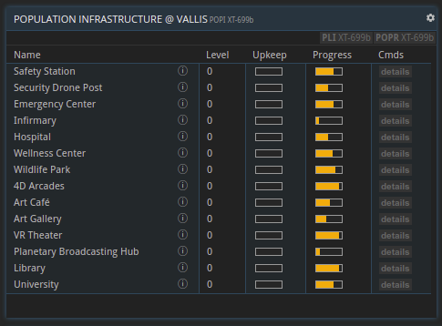
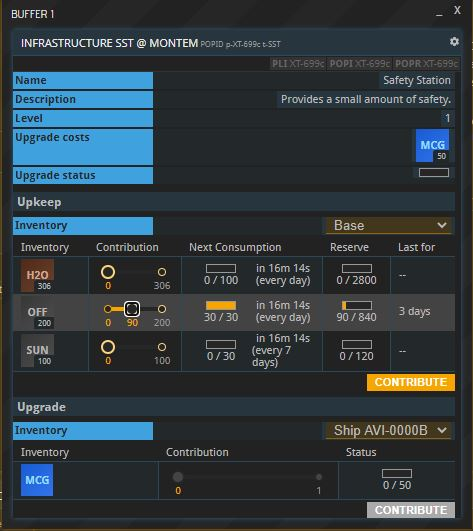

## Info 
Please note that planetary populations have not been released yet. They will be released with the *Populous* update early September.

## Overview
A planet's population consists of the combined workforces of all players owning a base on the planet. Each workforce tier will express specific needs that have to be satisfied by building and maintaining the appropriate population infrastructure projects. Satisfying a population's needs will positively impact its happiness and thereby its growth. Each week, the population is distributed evenly among all base owners on the planet depending on how many workers their production lines require.

## Needs
There are six different needs:
* __Life Support__: This need is always fulfilled on habitable planets. On unhabitable planets, it has to be provided by habitation buildings. If the total population exceeds the total habitation capacity, fulfillment will decrease.
* __Safety__: This need is mostly fulfilled by building certain population infrastructure projects. A small amount of safety is provided by each player's base.
* __Health__: This need is mostly fulfilled by building certain population infrastructure projects. A small amount of health is provided by each player's base.
* __Comfort__: This need is fulfilled by building certain population infrastructure projects.
* __Culture__: This need is fulfilled by building certain population infrastructure projects.
* __Education__: This need is fulfilled by building certain population infrastructure projects.

### Need Tiers
Needs are categorized into four tiers:
1. Life Support
2. Safety & Health
3. Comfort & Culture
4. Education

Needs of a higher tier can only be fulfilled as well as the worst-fulfilled need of the tier below. For example, if a population's safety need is only fulfilled by 60%, but its comfort need is fulfilled by 80%, the effective comfort need fulfillment will be reduced to 60%. This is the case for *all* workforce tiers.

### Need Priorities

Additionally, each workforce tier has different priorities in how important certain needs are to them (i.e. how much they can affect their resulting happiness). These are the most important needs per workforce tier:
* Pioneers: Life Support and Safety
* Settlers: Life Support, Safety and Health
* Technicians: Health, Safety and Comfort
* Engineers: Comfort and Culture
* Scientists: Education, Culture and Comfort

## Happiness & Growth

Fulfilling a population's needs will generally increase its happiness. A population's current happiness is determined from their happiness over the course of the last four weeks, with the last week being the most important.

_The weekly population report provides an overview of all the workforce tiers and their happiness._

Another important factor in determining a workforce tier's happiness is the number of available jobs (i.e. production lines not working at full worker capacity). If there are more jobs than workers of a certain tier, this tier receives a happiness bonus. If there is unemployment (i.e. more workers of a certain workforce tier than there are jobs), happiness is reduced.

A happy workforce tier (happiness > __70%__) will grow. Growth will be faster the happier a workforce tier is. An unhappy workforce tier (happiness < __50%__) will decline. The size of a planet's workforce plays a vital role in the weekly [worker redistribution](#worker-redistribution).

__Important:__ Engineers and scientists do not grow on their own, but have to emerge from lower tiers. More on that under ["Population Shifts"](#population-shifts).

__Explorer's Grace__: Planets that are colonized for the first time (i.e. there were no player bases on them before), receive a bonus of 50% on their population's happiness for the first four weeks.

### Population Shifts
Besides population growth from happiness, there is another mechanism that causes parts of a workforce tier to "level up" to the next. If a workforce tier grows, a percentage of the new workers will shift into the next tier. Note that this is the _only_ way for the engineer and scientist tiers to grow!

The exact level-up percentage depends on the target tier's happiness. For example, a really happy scientist tier will make shifts from engineer to scientist more likely. Additionally, the percentage can be increased by building and leveling up educational infrastructure (planetary broadcasting hub, library, university).

## Population Infrastructure

There are a total of 16 population infrastructure buildings contained within the "Population Infrastructure" planetary project. In this overview screen you can see the level they're currently on (level 0 is "not constructed", level 10 is the maximum), the fulfillment status of their upkeep, as well as the progress towards the next level.

All infrastructure projects provide need fulfillment in one or two categories. For more details simply hover over the information icon in each line. The educational projects additionally increase the level-up percentages for each workforce tier (see ["Population Shifts"](#population-shifts)).

Each population infrastructure building has two sections you can contribute to. The __"Upkeep"__ of the building determines how efficient it will be able to provide need fulfillment for the planet's population. Upkeep commodities are consumed regularly and have to be refilled. A certain amount can be stored for the future (see the "Reserve" column).

In the __"Upgrade"__ section, you can contribute materials to make progress towards the next building level. Higher-level infrastructure provides more need fulfillment, but also requires more upkeep.

## Worker Redistribution
Once a week when the new population report is generated, all workers on a planet are redistributed evenly among all player on the planet, as long as their current setup of production lines requires them. For example, if two players require scientists and there are 4 scientists in the planetary pool, both players will get 2 scientists each.

There are a couple of exceptions to consider:
* When you found a new base on a planet, you get 200 pioneers that are allocated to your base up until the next worker redistribution. This means you can immediately fill up to 200 pioneer positions.
* There is a "workforce reserve pool" of a certain size on each planet. This means a percentage of workers of each workforce tier will not be distributed automatically but is held back. Workers from the reserve pool can be recruited instantly during the week by building a new production building that requires them. However, each player can only instantly recruit a small percentage of the pool for themselves every week. (Note: If there are more players requiring workers of a certian tier than there are workers, these workers will be added to the reserve pool as well.)

_The amount of workers you can instantly recruit from the workforce reserve pool is shown in brackets next to every building's workforce requirements._

## About this page

This page is part of the introductory tutorial, which encompasses parts 1 and 2 (2.1-2.5). Use the arrows on the sides to cycle through all available tutorials in order, from introductory to more and more specific topics.

If you encounter an error or cannot find the answers to your questions, we will gladly help you on our [Discord server](https://discordapp.com/invite/G7gj7PT).