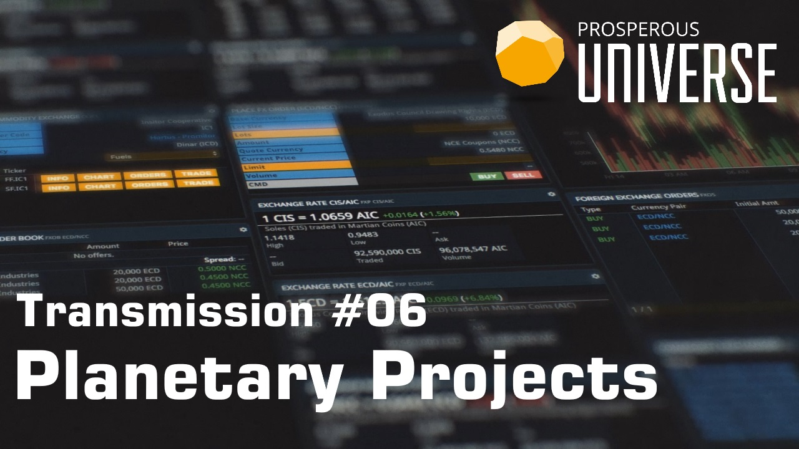
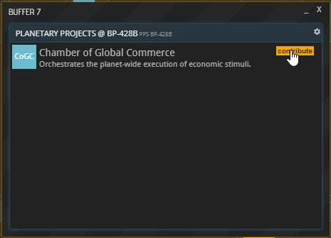
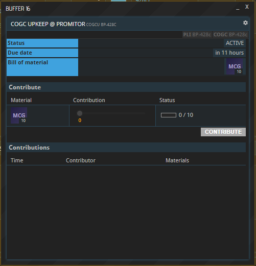
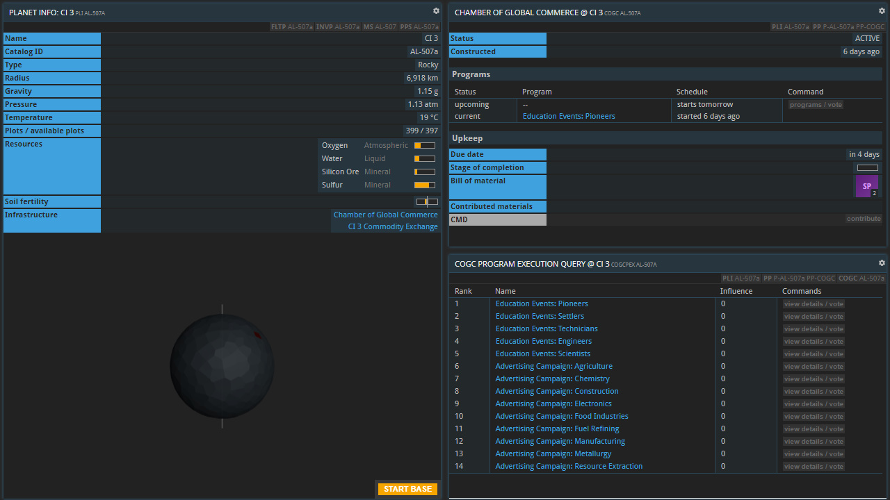
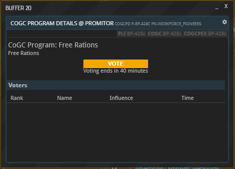

---
title: "6. Planetary Projects"
date: 2018-09-18T17:13:49+02:00
weight: 10
---

This guide is also available in video format. __Click on the image below to watch the video or scroll down for the written version.__

## Introduction

Planetary projects are collectively erected and maintained structures that provide a bonus or service to the inhabitants of a planet. If projects are present on a planet, they will be listed under “Infrastructure” in the PLI window as well as the PPS window (accessible at the top of the PLI window).

Clicking “details” next to an entry in the PPS window will reveal more information on that project.

## Building a planetary project

New planetary projects can be initiated by anybody with a base on the respective planet. To do so, open the planet’s PPS window and select “contribute” next to the desired planetary project.

In the new project window - the project being a CoGC in this example -, you can track the cost of building the project, the progress that has been made towards its construction, and the individual contributions made by inhabitants of the planet. Use the sliders to select the size your contribution.

Once all contributions have been filled by the planet’s inhabitants, the finished project will become visible as a green plot on the planet. Clicking the plot will open a new buffer about the project.

## Planetary project types

Once built, a planetary project requires an upkeep to stay active. As long as the upkeep is not being paid, the project remains “on strike” and provides no bonuses. Similarly to the construction of a planetary project, contributions towards its upkeep can be made by anyone residing on the planet in question.

To contribute, open the project’s buffer by clicking its name under “Infrastructure” or its plot on the planet (in a PLI window). Under “Upkeep”, select “contribute”. In the new window, set the slider(s) to the desired amount and hit “CONTRIBUTE”. Your contribution will be listed at the bottom along with all other recently made contributions.

### Chamber of Global Commerce (CoGC)

A Chamber of Global Commerce can run a variety of programs to stimulate a planet’s economy. Open the buffer of a CoGC by clicking its name under “Infrastructure” or its plot on the planet (in a PLI window). In the new CoGC window that opened up, you can see the CoGC’s current and upcoming programs listed under “Programs”.

#### Voting for Programs

To vote on the upcoming program, select “programs / vote”, which opens up a list of all available programs. Note that only rated companies can cast their vote, i.e. those which are operating under an APEX [PRO License](https://hub.prosperousuniverse.com/license/purchase).

Click a program’s name or the respective “view details / vote” button learn more about it. Hit “Vote” to give your vote to the desired program; the one with the most votes will be listed as the upcoming program in the planet’s COGC buffer.

Votes are not equal, but instead depend on the voting company's influence, which in turn depends on the size and composition of their work force. Each _individual worker_ grants influence; a pioneer grants 1 influence, and hence 100 pioneers grant 100 influence. Higher tier workforces have higher multipliers:  

| Worker type 	|	Influence multiplier	|
|---------------|---------------------------|
| Pioneer 		| 1							|
| Settler		| 1.25						|
| Technician 	| 1.5						|
| Engineer		| 1.75						|
| Scientist		| 2							|

For example, a company employing 200 pioneers, 100 settlers, and 200 technicians has an influence of 200 * 1 + 100 * 1.25 + 200 * 1.5 = 625.

#### Upkeep Costs

The CoGC's programs require payment of an upkeep cost in the form of materials to go into effect.  

The materials required as upkeep are DW, MCG, PE and RAT.  The total amount required of each material in upkeep is determined by the number of player bases on the planet multiplied by the material multiplier.  The multipliers are 3x for DW, 4x for MCG and PE, and 2x for RAT.  The minimum upkeep cost of five times the multipliers is used until a planet has enough bases to surpass it.

### Local Markets

Local Markets are a means for exchanging goods outside of Commodity Exchanges. Due to their important role in the economy, please refer to [this dedicated tutorial](../local-markets) on how they are used.

## About this page

This page is part of the advanced tutorial series, which encompasses parts 3 through 8. Use the arrows on the sides to cycle through all available tutorials in order, from introductory to more and more specific topics.

If you encounter an error or cannot find the answers to your questions, we will gladly help you on our [Discord server](https://discordapp.com/invite/G7gj7PT).
