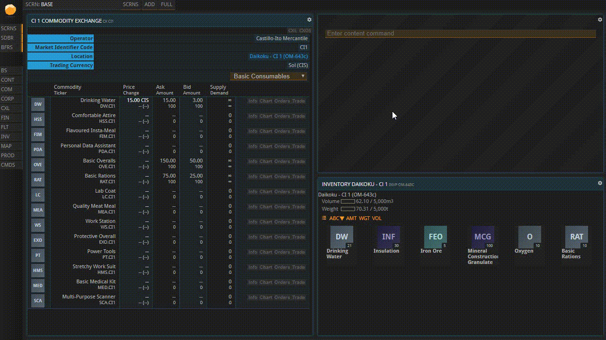
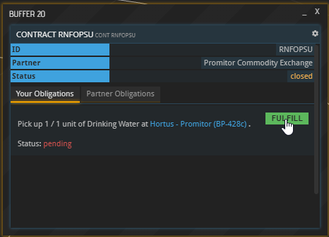

Now that your base is built, this guide will teach you how to start producing and trading commodities. It is also available in video format. __Click on the image below to watch the video or scroll down for the written version.__

Follow along the steps below in APEX.

### Buying Commodities

Each market, or “Commodity Exchange”, is on a specific planet or a specific space station. There are several ways to find your closest Commodity Exchange. The easiest is opening the System map, finding the planet on which your base is located and then checking whether it or any of the close-by planets show a little chart symbol when hovering over them. You can also find a list of all commodity exchanges using the CXL shortcut in the left sidebar.

If your planet does not have its own Commodity Exchange, you will need to send ships to a planet or station that has one in order to pick up your wares after you bought them. If that is the case, you will learn how in the paragraph titled “Contracts” later. Make sure you do not trade on a market in another system before you understand foreign exchange because you are probably going to need a different currency there.

Click the Commodity Exchange symbol. You should integrate your local commodity exchange buffer into a tile now because you are going to need it frequently. Note that all products are listed in every Commodity Exchange, but the buy and sell orders you can see are always limited to the Commodity Exchange on which they were placed. They are not global – if, for example, the product you want is not being sold on your Commodity Exchange (or for a horrendous price), have a look at the Commodity Exchanges of other planets and stations.

You are likely going to need two kinds of resources soon: Consumables to keep your workforce fed and productive, and - unless you possess only production buildings from the Resources tab - input materials for your Production Lines. Sooner or later, you might also need fuel for your ships.

Select the “POPULATION” button in your base overview to view the upkeep of your workforce. As you can see, 4 units of Drinking Water are required per 100 Pioneers. They will be deducted from your Inventory at the start of each 24-hour period. Decide how many units you would like to buy in advance, and make sure you do not spend all your money on them now. Also note that some Drinking Water was already provided to you as part of your starting package.

Back in the window showing your local Commodity Exchange, select “Basic Consumables” from the dropdown menu. Click “Orders” next to the Drinking Water entry. You can now see the prices that this commodity is currently being offered for (labeled “Offers”), and a list of interested buyers as well as the prices they are willing to pay (labeled “Requests”).

Close the buffer now and select “Trade”, right next to the “Orders” button. The “Storage Location” line in the new buffer is only relevant if you are placing a Sell Order, so the system knows in which Inventory to look for the commodity you are selling. Right now, you want to buy, so you can ignore it. Now enter the Amount you want to buy and indicate how much you are willing to pay per unit under “Limit”. The cheapest current offer is listed under “Current Price”, and if you want to get the commodities right now, you will have to pay that price.

If you were to set it to anything lower than that and hit “BUY”, your bid would be added to the “Requests” column you saw a minute ago. Then you would have to wait until someone came along who was willing to sell it to you for the amount you entered. To get your goods immediately, you need to set at least the Current Price as your Limit. If you set your bid to anything higher than that, you will still only pay the Current Price.

_The second buy order is lower than any of the offers, so it is cued up as a Request_

If you placed an order below the current asking price which you now wish to delete, open your Order Book using the CXOS command. You will see all your orders there. Hit “DELETE” next to the order you want to withdraw.

### Buying Input Materials

The next thing you might need to buy now is Input materials for your Production Line(s). (“Production Line” is simply another term for one type of building that produces goods, like, for example, the Prefab Plant 1. All Prefab Plants 1 in a base, be it one or many, will make up one Production Line.) Input materials are commodities that are processed into another commodity in your Production Line. If your first Production Line consists of buildings found in the “Resources” tab, it doesn’t require any Input materials. All buildings in the Pioneers tab, however, take Input materials.

Hit the “Sections” button in your base overview, and click the symbol(s) of your producing building(s). The “Products” section shows which commodities can be produced here and which Input materials, if any, are required for that to happen. Think of each of these lines as a chemical reaction: everything left of the arrow - the input materials - goes in, the product on the right comes out. Later, when the building has been constructed in your base, you will be able to choose which of these reactions you want to happen each time you produce something.

Which output _should_ you produce? To make that decision, have a look at the Commodity Exchange and check what people are buying. Is there anything everybody needs right now or that people will need soon? Or some shortage you could profit off? You can also ask around in the public communication channel.

Now go ahead and buy whichever Input materials you require for the desired output. It is possible that you don’t get all the Input materials you want right now. See which ones are already available, start producing what is possible, and check back soon for anything you might not have gotten. Especially if your section of space has just recently been settled, the market might take a while until more refined commodities become available.

### Contracts

Open your base’s Inventory now. If you can already see the goods you just purchased, you can omit this next bit and skip right to the topic of constructing sections.

If the commodities you bought are not in your Inventory yet, you now have to go and get them. This happens when neither your base nor any of your ships are currently located at the location where you made the purchase. The moment you made your first purchase, a contract popped up in the sidebar. (If you cannot see the sidebar, you can toggle it on by clicking “SDBR” on the left.) Click a contract ID to see more information.

Alternatively, you can open a list of your contracts by using the “CONTS” command. Next, click “view” to open the details of a contract, and you will see that the units you ordered have been reserved for you and are awaiting pick-up. The button labeled “Fulfill” is greyed out because you have no ship at the location to pick the cargo up with, so you have to send one.

You are now going to learn the exact steps required to pick up your cargo. For more extensive information on the subject of space travel, check out the [Space flight tutorial](/../space-flight). If your Fleet window is not open yet, bring it up now using the FLT command shortcut in the left sidebar, then open one of your ships’ cargo holds by clicking its cargo space. Note that a ship’s cargo space is limited, and for bigger purchases it might be necessary to send multiple ships. Your cargo hold is limited by the available space (in cubic meters) and maximum weight of its contents.

In the Contract buffer that opens up, you can see the target planet’s ID:

Now hit the “FLY” button next to the desired ship's entry in the Fleet window to bring up the Ship Flight Control. Copy the target planet's ID into the Flight Control’s Destination field and then set the fuel usage. The higher the fuel usage, the sooner your spacecraft will arrive, but setting it to one-hundred percent means that it won’t have a drop of fuel left to return home and the trip would be unreasonably expensive. Note that, depending on the distance of your trip, you may not be able to spend 100 % of your fuel.

In any case, the flight will take several hours during which you cannot do anything but wait. Your ship’s position is tracked in the System Map and Universe Map as a yellow triangle. If you do not see it, toggle on “fleet” in the bottom right corner.

Your fingers are probably itching to explore more of APEX right now, but space is vast and real work takes time. That is why, for better or for worse, waiting is part of the APEX experience. However, as your business grows, you will have more and more things to do while waiting for other processes to finish.

Once your ship has arrived, the Fulfill buttons of the active contracts you have at your target location will turn green. If they don’t, the reason might be that the target market is on the planet surface and your ship is still in orbit.

To fix that, select the ship’s FLY button in the Fleet window again, enter the ID of the planet it is orbiting, check “Planetary landing” and select “START” once more.

By now, the “Fulfill” buttons on the active contracts you have on that market should have turned green. Click them to load up your ship with the goods you purchased and send it home the same way you sent it out before. Once it arrives at your home base, make sure to drag and drop the materials you purchased from its cargo space into your Base’s inventory.

### Placing Production Orders

The last thing you need to learn now is how to place Production orders. (Do not confuse them with Buy orders and Sell orders made on Commodity Exchanges.) Right now, your workforce is idle and awaiting your commands.

Bring up your Production Lines by selecting “Production” in the Base overview. You should see the name(s) of your production building(s) and an array of empty boxes underneath. Those boxes can be filled with orders by selecting “New Order” right above them (or via “Details” - “New Order”). The PRODCO buffer which now opened up lets you choose which commodity you would like to produce. As established, some buildings can only produce one commodity while others offer a wide variety of choices in the dropdown labeled “Primary Output”. You can also see here which Input materials are required for which output. Remember that you may have already decided what to produce earlier, when you bought your input materials.

You can always produce one type of commodity per order. Once you selected it, set the Order Size. The higher it gets, the longer the order will need to process and the more input materials will be required. You will find that this is very handy. If, for instance, you know you cannot check back with your company for a while, just set it to a high value, and your workers won’t run out of things to do while you are gone. Start processing the order by hitting “QUEUE ORDER”, and it will show up in your Production Lines window. If you are not missing any input materials, it is now being processed, and you will be able to track its progress and the time remaining. Send out more orders until your queue is filled up. You can pick a different output material for every order as you desire. Once queued, an order can be canceled by selecting “Details” below your Production Line and then “Cancel” next to the order. Once an order is being processed, it can no longer be canceled.

That is all you need to know to get your company off the ground. Contrary to what you might be thinking now, you have just scratched the surface of things you can do in APEX. Throughout the next few days and weeks, placing buy and sell orders, observing the market, coordinating with other licensees and making cargo runs with your ships will become second nature to you before you know it. When you are ready to get into more advanced topics, like Foreign Exchange or Faster Than Light travel, continue with more tutorials.

## More tutorials

* [APEX overview](LINK)  
* [Space flight](LINK)  
* [Foreign Exchange](LINK)  
* More to come!

Use the arrows on the sides to cycle through all available tutorials in order, from introductory to more and more specific topics.