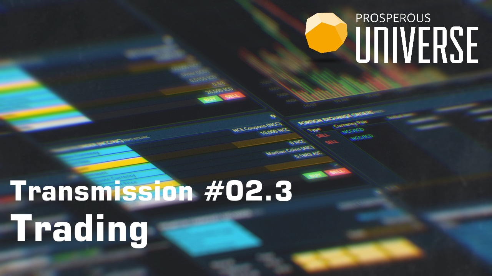
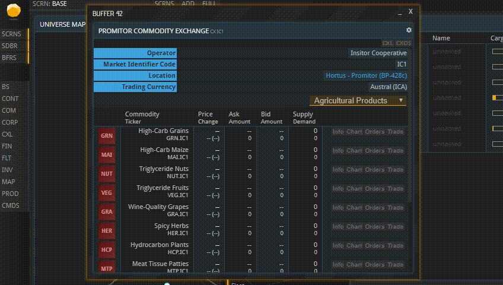
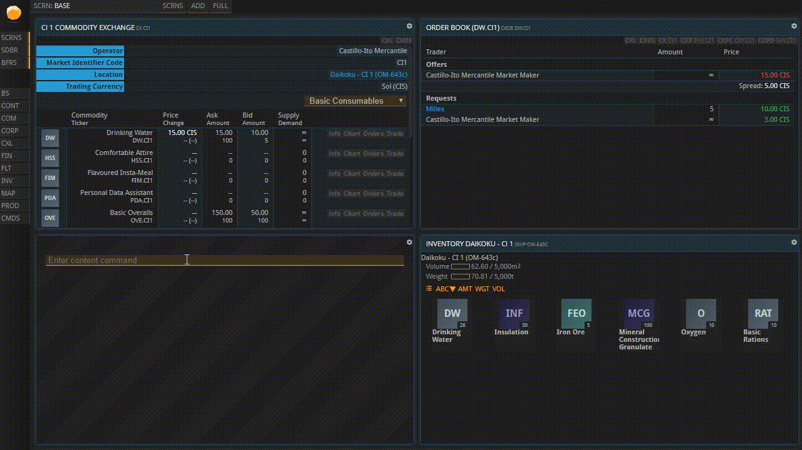

This guide is also available in video format. __Click on the image below to watch the video or scroll down for the written version.__

Follow along the steps below in APEX.

### Commodity Exchanges

Each market, or “Commodity Exchange”, is on a specific planet or a specific space station. There are several ways to find your closest Commodity Exchange. The easiest is opening the System map, finding the planet on which your base is located and then checking whether it or any of the close-by planets show a little chart symbol when hovering over them. You can also find a list of all commodity exchanges using the CXL shortcut in the left sidebar.

_Shown here: three different ways to access your nearest Commodity Exchange_

(If your planet does not have its own Commodity Exchange, you will need to send ships to a planet or station that has one in order to pick up your wares after you bought them. If that is the case, you can look up how in the [“Contracts” tutorial](../contracts). Make sure you do not trade on a market in another system before you understand foreign exchange because you are probably going to need a different currency there.)

Assuming your planet does have a Commodity Exchange, click its symbol now. You should integrate your local commodity exchange buffer into a tile because you are going to need it frequently. Note that all products are listed in every Commodity Exchange, but the buy and sell orders you can see are always limited to the concrete Commodity Exchange on which they were placed. They are not global – if, for example, the product you want is not being sold on your Commodity Exchange (or for a horrendous price), have a look at the Commodity Exchanges of other planets and stations.

You are likely going to need two kinds of resources soon: Consumables to keep your workforce fed and productive, and - unless you possess only production buildings from the Resources tab - input materials for your Production Lines. Sooner or later, you might also need fuel for your ships.

Select the “POPULATION” button in your base overview to view the upkeep of your workforce. As you can see, 4 units of Drinking Water are required per 100 Pioneers. They will be deducted from your Inventory at the start of each 24-hour period. Once you run out of water, your Pioneers will go on strike. Decide how many units you would like to buy in advance, and make sure you do not spend all your money on them now. Also note that some Drinking Water was already provided to you as part of your starting package.

### Example: Buying Consumables

Back in the window showing your local Commodity Exchange, select “Basic Consumables” from the dropdown menu. Click “Orders” next to the Drinking Water entry. You can now see the prices that this commodity is currently being offered for (labeled “Offers”), and a list of interested buyers as well as the prices they are willing to pay (labeled “Requests”).

Close the buffer now and select “Trade”, right next to the “Orders” button. The “Storage Location” line in the new buffer is only relevant if you are placing a Sell Order, so the system knows in which Inventory to look for the commodity you are selling. Right now, you want to buy, so you can ignore it. Now enter the Amount you want to buy and indicate how much you are willing to pay per unit under “Limit”. The cheapest current offer is listed under “Current Price”, and if you want to get the commodities right now, you will have to pay that price.

If you were to set it to anything lower than that and hit “BUY”, your bid would be added to the “Requests” column you saw a minute ago. Then you would have to wait until someone came along who was willing to sell it to you for the amount you entered. To get your goods immediately, you need to set at least the Current Price as your Limit. If you set your bid to anything higher than that, you will still only pay the Current Price.

_The second buy order is lower than any of the offers, so it is cued up as a Request_

If you placed an order below the current asking price which you now wish to delete, open your Order Book using the CXOS command. You will see all your orders there. Hit “DELETE” next to the order you want to withdraw.

Open your base’s Inventory now. If you can already see the goods you just purchased, you can omit the “Contracts” tutorial and skip right to the topic of [“Production” (2.5)](../production). You may come back later to learn about contracts, which are generated when buying wares on a market with none of your ships or bases present.

## About this page

This page is part of the introductory tutorial, which encompasses parts 1 and 2 (2.1-2.5). Use the arrows on the sides to cycle through all available tutorials in order, from introductory to more and more specific topics.

If you encounter an error or cannot find the answers to your questions, we will gladly help you on our [Discord server](https://discordapp.com/invite/G7gj7PT).