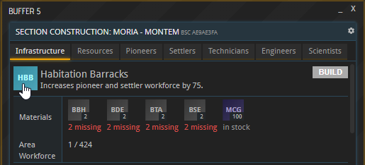
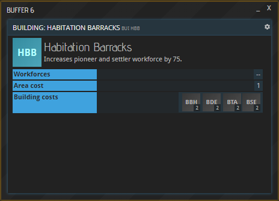

This page lists all the rules in place for building costs. If you would like to know how to set up buildings, have a look at the [Base setup](LINK) page.

## General information

The basic building costs of each building can be looked up in your base's BSC window (hit “CONSTRUCT” in your base overview):

Clicking any of the buildings' symbols will reveal their BUI window, which shows their Building costs:

However, this information only paints a part of the picture. It pertains to _this_ particular base, which is located on a concrete planet. Costs for erecting structures on other planets may deviate based on the set of rules below. 

## Costs calculation

Every building needs a certain configuration of Construction Prefabs to be built. On top of that, Construction Materials (“Additional resources” below) will be required _once_ for _every_ building depending on the environmental conditions at hand. The exact number of some additional resources depends on the Area cost of a building, which is indicated in its BUI window (see screenshot above).

Please note that all these additional costs also pertain to [Planetary projects](../../tutorials/planetary-projects) and [Corporate projects](../../tutorials/corporations/#corporate-actions-and-projects).

### Rocky Planets

__Additional resource:__ Mineral Construction Granulate (MCG)  
__Amount:__ Area x 1

### Gaseous planets
__Additional resource:__ Aerostat Foundation (AEF)  
__Amount:__ Area x 1

### Atmospheric pressure  

#### Low pressure (< 0.25 atm)

__Additional resource:__ Poly-Sulfite Sealant (SEA)  
__Amount:__ Area x 1

#### High pressure (> 2.0 atm)

__Additional resource:__ Hardened Structural Elements (HSE)  
__Amount:__ 1 per building

### Gravity

#### Low gravity (< 0.25 g):

__Additional resource:__ Magnetic Ground Cover (MGC)  
__Amount:__ 1 per building

#### High gravity (> 2.5 g):

__Additional resource:__ High-Oxygen Breathable Liquid (BL)  
__Amount__: 1 per building  
_Please note: This commodity is listed under Chemicals, not Construction Materials._

### Temperature

#### Low temperature (<-25° C):

__Additional resource:__ Insulation (INF)  
__Amount:__ Area x 10

#### High temperature (> 75° C):

__Additional resource:__ Thermal Shielding (TSH)  
__Amount:__ 1 per building

### Fertility
If a planet is completely infertile, each Hydroponics Farm requires 16 Metal Halide Lamps. Farms and Orchards cannot be built at all.

## About this page

This page is part of the APEX handbook's wiki section. If you are looking for an introduction to APEX, please refer to the [tutorials](../../tutorials).

If you encounter an error or cannot find the answers to your questions, we will gladly help you on our [Discord server](https://discordapp.com/invite/G7gj7PT).