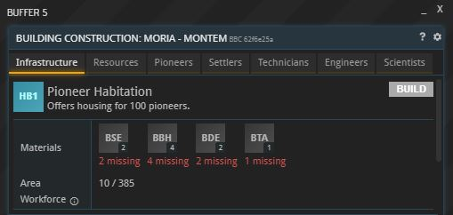
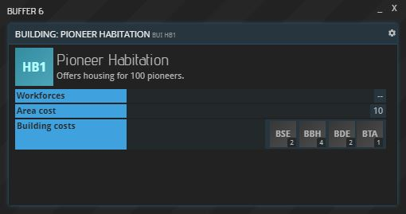

本页面列出了所有关于建筑成本的规则。如果您想了解如何设置建筑，请参阅[基地设置页面](../../tutorials/current-tutorials/02-first-base/index.html)。

## 一般信息

每个建筑的基本建造费用都可以在你基地的 BSC 窗口中查看（在基地概览中点击“建造”）：

点击任意建筑的标志将显示其 BUI 窗口，其中会显示其建造费用：

然而，这些信息只包含了部分情况。它仅适用于 _这个位于岩质星球上的基地_ 。在其他星球上建造建筑的成本可能会根据以下规则有所不同。

## 成本计算

每栋建筑都需要特定配置的建筑预制件才能建造。除此之外，根据当前的环境条件， _每栋_ 建筑还需要 _一次性_ 提供建筑材料和/或建筑部件（以下简称“额外资源”）。某些额外资源的具体数量取决于建筑的区域成本，这在其 BUI 窗口中有所显示（参见上图）。

请注意，所有这些额外成本也适用于[行星项目](../../tutorials/planetary-projects)和[集团项目](../../tutorials/corporations/#corporate-actions-and-projects)。

### 岩石行星

__额外资源__：矿物建筑颗粒（MCG）  
__数量__：面积 x 4

### 气态行星
__额外资源__：悬空自稳定地基（AEF）  
__数量__：面积 / 3

### 大气压

#### 低压（< 0.25 标准大气压）

__额外资源__：聚亚硫酸盐密封胶（SEA）  
__数量__：面积 x 1

#### 高压（> 2.0 标准大气压）

__额外资源__：硬化结构部件（HSE）  
__数量__：每栋建筑 1 个

### 重力

#### 低重力（< 0.25 g）

__额外资源__：磁性地面覆层（MGC）  
__数量__：每栋建筑 1 个

#### 高重力（> 2.5 g）

__额外资源__：可呼吸液体（BL）  
__数量__：每栋建筑 1 个  
_请注意：此商品归类为化学品，而非建筑材料。_

### 温度

#### 低温（< -25° C）

__额外资源__：绝热泡沫（(INS）  
__数量__：面积 x 10

#### 高温（> 75° C）

__额外资源__：热屏蔽（TSH）  
__数量__：每栋建筑 1 个

### 肥沃度
农场和果园需要建在土壤肥沃的星球上。

{}
