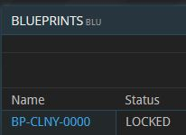
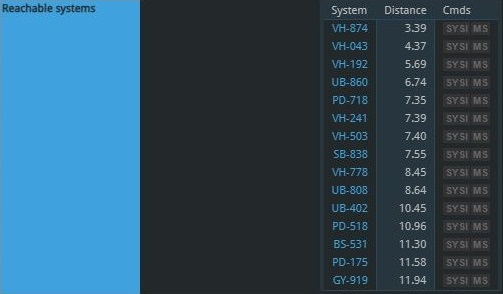
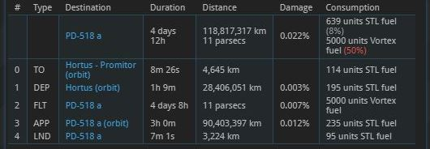

## Entwurf

Ein Kolonieschiff ist eine besondere Art Schiff mit einem vordefinierten Entwurf, der standardmäßig in der Entwurfsliste (BLU) jedes Spielers vorhanden ist – ähnlich wie der des Startschiffs. Der Status des Entwurfs ist stets "LOCKED", sodass Kolonieschiffe ausschließlich anhand dieses exakten Entwurfs gebaut werden können.

Ein wesentlicher Unterschied zu regulären Schiffen besteht darin, dass Kolonieschiffe weder über einen FTL-Reaktor noch über einen FTL-Treibstofftank verfügen, sondern stattdessen eine spezielle Art von Antrieb nutzen, den **Vortex-Antrieb**.

## Flug

Der Vortex-Antrieb eines Kolonieschiffs ermöglicht es, unabhängig von FTL-Verbindungen in nahegelegene Systeme zu reisen. Das bedeutet: Auch wenn es keine FTL-Verbindung zwischen den Systemen A und B gibt, kann ein Kolonieschiff dennoch zwischen ihnen reisen, sofern das Zielsystem nicht zu weit entfernt ist.

Im Flugleitsystem (SFC) eines Kolonieschiffs kannst du vor der Eingabe eines Zielorts alle Systeme sehen, die in Reichweite liegen. Diese Liste kann als Ausgangspunkt dazu dienen, einen Zielplaneten innerhalb eines dieser Systeme auszuwählen.

Der STL-Flug eines Kolonieschiffs funktioniert auf genau wie jedem anderen Schiff. Allerdings enthält sein Flugplan anstelle der üblichen FTL-bezogenen Schritte einen "Floating"-Schritt (FLO). Dieser Schritt dauert immer mehrere Tage (länger bei größeren Entfernungen) und verbraucht stets eine festgelegte Menge an Vortex-Treibstoff.

## Anwendung
Es ist zu beachten, dass Kolonieschiffe nicht als reguläre, effiziente Methode zum Transport von Gütern zwischen Systemen gedacht sind. Stattdessen sind sie in bestimmten Situationen nützlich, um Lücken im FTL-Netzwerk des Universums zu überbrücken. So können sie etwa vollständig abgetrennte Sektoren zugänglich zu machen oder besonders lange FTL-Umwege vermeiden (zumindest dann, wenn der Preis des benötigten Vortex-Treibstoffs gerade günstig genug ist).

{}
