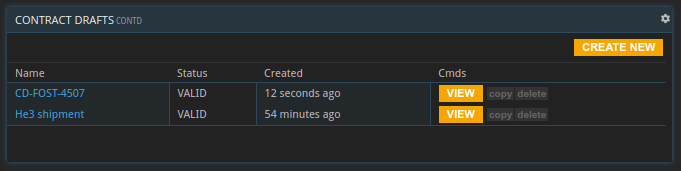
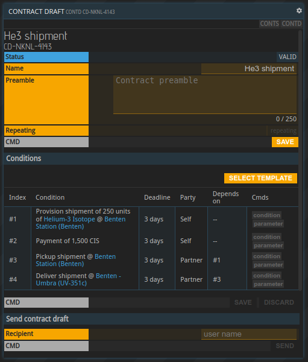

## General information

The `CONTD` command allows the creation, editing and sending of contract drafts in order to create custom contracts with other parties. Custom contracts got introduced with the **Convergence** release and currently only support drafts created from three different contract templates.

## List of contract drafts

Opening the `CONTD` command without any parameters will show the list of all contract drafts:

It is possible to create new drafts, copy drafts, deleting drafts and opening existing drafts to edit them.

## Editing a contract draft

A contract draft has two sections, one for the general information and one for the conditions.

In the first section the contract can be named. The name is private and will not be visible to the contract party. Its purpose is to be able to remember what specific contract drafts are for. The contract preamble is a free text field that will be transmitted once the draft is sent to another party. The contract creator can express their intentions with the contract in text form, rather than just contract conditions.

The second section is about the contract's conditions. Selecting and applying a template fills the list of contract conditions with the respective template. The templates are based on the local market ad types BUY, SELL and SHIPMENT.

Similar to the blueprints, any changes will only be saved once the save button is hit. Pressing 'DISCARD' will reset the draft to its last state. 

Individual conditions can be adjusted with the 'condition' button. Depending on the condition an overlay will allow changing materials, locations currencies, amounts etc. The 'parameter' button allows changing a condition's deadline.

## Sending a contract draft

A contract draft can be sent to any licensee. Sending the contract will create a copy of the contract draft and convert that copy into a regular contract. It will be visible in the list of contracts `CONTS` in the open state.

The recipient receives an alert about the new contract and can review it. A contract can either be closed or rejected. In both cases the sender will receive a notification about it.

Making changes to the contract draft after it was used to create a contract will not change the created contracts. A contract draft can be used as multiple times.

Adding someone to the blocklist will prevent the reception of contract drafts from that licensee.

Sending a contract draft requires a `PRO` license, closing one either `BASIC` or `PRO`.

{}
