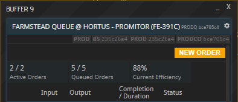
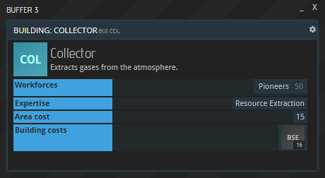
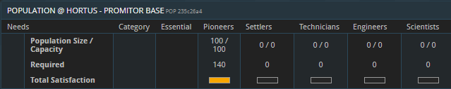
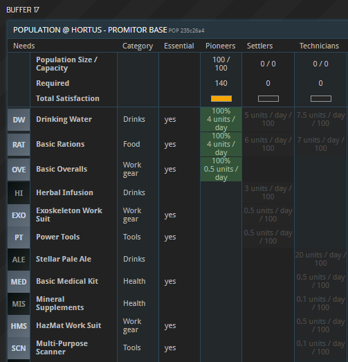
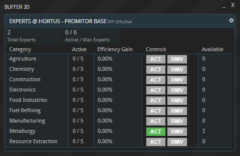
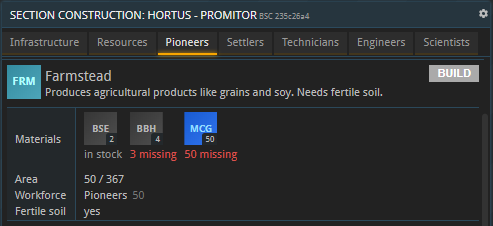
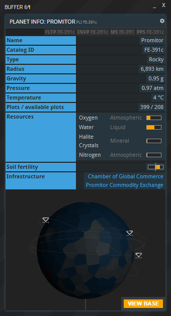

## 一般信息

每条生产线在运行时都具有一定的效率。效率决定了生产订单完成所需的时间：效率越低，生产时间越长；效率越高，生产时间越短。生产线当前的效率可以在其生产队列缓冲区（PRODQ）中查看：

建筑状况、劳动力可用性和满意度提供了基础效率值。专家会为他们专业领域的生产线提供额外加成。活跃的 CoGC 项目也可能使某些行业或劳动力类型受益。最后，土壤肥力（或缺乏肥力）会为某些生产线的效率提供额外的加成（或惩罚）。

### 建筑状况

生产建筑在建造后效率最高，然后开始老化。老化会随着时间的推移缓慢增加，直到建筑仅以其原始效率的 33%运行，此时它不再老化。值得注意的是，所有建筑都可以在被认为效率低时进行维修（并且应该维修）。

### 劳动力可用性

每条生产线都会雇佣一定数量和类型的劳动力，这在其 BUI 窗口的“劳动力”下显示：

如果只提供了所需劳动力的一部分，建筑仍然可以运行，但效率会降低。多个需要相同劳动力的建筑会累加计算。

除了满意度（稍后会详细介绍），人口窗口列出了每种工人类型的三项指标：
1. 人口规模：基地中实际存在的劳动力数量。决定了消耗品的使用速度。
2. 容量：您的基地目前可容纳的劳动力数量。
3. 需求：您所有生产线总共可雇佣的劳动力数量。

以下规则适用：
- 如果“容量”小于“需求”，则所有需要相应类型劳动力的生产线的效率都会受到负面影响。更准确地说，效率会乘以可用工人的百分比，即：_效率 x (人口规模 / 需求)_
- 如果“容量”大于“需求”，则居住模块不会完全填满，这意味着实际在岗劳动力数量（即“人口规模”）低于“容量”。
- 即使没有订单排队或生产停止，所有生产线都会雇用劳动力。闲置的劳动力不能从一个建筑转移到另一个建筑。

### 劳动力满意度

每种劳动力都有自己的需求，需要得到满足才能保持效率。劳动力需求可以在基地的“人口”窗口中查看。例如，100 名先驱者每天需要 4 个 DW、4 个 RAT、0.5 个 OVE、0.5 个 COF 和 0.2 个 PWO 才能完全满意；而 100 名定居者则需要 5 个 DW、6 个 RAT、3 个 HI、0.5 个 EXO 和 0.5 个 PT。

如果奢侈品和非奢侈品需求都得到满足，效率将保持在 100%；如果只有必需品可用，效率则会降低。例如，如果只有 DW、RAT 和 OVE 可供消费，先驱者的满意度将为 79%。只要生产力至少有一种必需资源可用，他们就会继续工作。只有当所有必需资源都耗尽时，生产才会停止。如果只有部分所需资源可用，生产力的满意度会降低，从而影响生产力。

有些消耗品是所谓的非必需品：缺少非必需品造成的生产力损失低于缺少必需消耗品。此外，如果劳动力唯一可用的消耗品是非必需品，他们将完全停止工作。“人口”面板列出了哪些消耗品是必需品，哪些不是：

#### 消耗品如何被消耗

基地人口会在消耗品在基地库存中可用时，立即领取接下来 24 小时所需的第一批足量消耗品（例如，100 名拓荒者需要 4 个 RAT），并立即从库存中扣减。24 小时后，同样的事情会再次发生，如此循环，直到消耗品用尽。这适用于每种消耗品：如果人口在中午 12 点开始消耗 DW，下午 4 点开始消耗 RAT，那么下一批 DW 将在第二天中午 12 点用完，下一批 RAT 将在第二天下午 4 点用完。

 __注意：即使没有生产活动，人口也会消耗资源！__ 闲置的劳动力与活跃的劳动力需求完全相同，并且仍会消耗基地库存中的消耗品。

### 专家

所有建筑都可以通过所谓的专家获得加成。您可以通过点击基地中的“专家”按钮查看您的专家。要使用他们，请点击“添加”；要移除他们的加成，请点击“移除”。

每位专家都会为特定行业提供加成。每个行业又包含不同的建筑：

| 专家 | 建筑（BUI标签） |
|-----------------------|-------------------------------------------------------------------			|
| 开采 | 采气站（COL），矿场（EXT），钻井（RIG），焚化炉（INC） |
| 制造 | 基础材料厂（BMP），纺织品制造厂（CLF），3D打印厂（PPF），纺织厂（WPL），中型部件总装厂（MCA），小型部件总装厂（SCA），航天器预制件厂（SPP），电器工厂（APF），高级电器工厂（AAF），航天器推进设备厂（SPF） |
| 农业 | 农场（FRM），水培农场（HYF），果园（ORC） |
| 食品 | 食品加工厂（FP），酿造厂（FER），体外生命培育厂（IVP） |
| 土木 | 一型预制件厂（PP1），焊接棚（WEL），二型预制件厂（PP2），单元预制件厂（UPF），三型预制件厂（PP3），四型预制件厂（PP4） |
| 冶金 | 冶炼厂（SME），金属工作室（FS），玻璃熔炉（GF），船板焊接厂（HWP），船只套装厂（SKF），高功率高炉（ASM） |
| 化工 | 化工厂（CHP），聚合物厂（POL），实验室（LAB），制药厂（PHF），锝加工厂（TNP），高级材料实验室（AML），锿浓缩厂（EEP） |
| 燃料 | 炼油厂（REF） |
| 电子 | 电子设备制造厂（EDM），无尘室（CLR），能源部件总装厂（ECA），电子厂（ELP），软件开发部门（SD），无人机厂（DRS），软件实验部门（SL） |

#### 专家生成率和加成

任何公司的首批专家都包含在其新手包中，但所有后续专家都只会随着时间的推移而出现。 __保持生产线运行__ 最终会在其领域中产生新的专家，例如，使用农场生产商品会随着时间的推移产生农业专家。在一个特定行业中达到总共 5 名专家后，该行业将不再产生新的专家。 _每个行业_ 最多可以有 5 名专家处于活跃状态，一个基地中 _所有行业_ 最多可以同时有 6 名专家处于活跃状态。

| 专家数量 | 所需天数 | 加成 |
|---------------|---------------|--------------|
| 1 | 10.00 | 3.06% |
| 2 | 12.50 | 6.96% |
| 3 | 57.57 | 12.48% |
| 4 | 276.50 | 19.74% |
| 5 | 915.10 | 28.40% |

以上所示天数是指单个建筑在 100%效率下的情况。在同一行业（即同一专业类别）中运营两座建筑，所需时间将减半；运营三座建筑，所需时间将降至三分之一，依此类推。当两座建筑属于同一生产线时，也会出现这种情况，例如，两座（三座、四座、五座……）农场将同样地缩短时间。

请注意，每次专家增长后，**所需天数**的累积都会重置。因此，从 0 名专家到 2 名专家将需要 22.50 天。

专家提供的加成是一个固定值，它会直接乘以劳动力的效率。例如，当基地激活 3 名专家后，原本以 90%效率运作的劳动力将以 101.2%的效率运作。`90% * (100% + 12.48%) = 101.2%`

### 土壤肥沃度

某些建筑的效率会受到行星土壤肥沃度的影响。如果如此，在 BSC 窗口中该建筑的条目旁边会显示相关指示。目前需要肥沃土壤的建筑是农场（FRM）和果园（ORC）。

星球的土壤肥力可以在其 PLI 窗口中查看。条形图的黄色部分越往右延伸，表示肥力越高；越往左延伸，表示肥力越低。__注意：如果显示的是两个破折号而不是条形图，则表示该星球贫瘠，这意味着受土壤肥力影响的建筑在此处根本无法运行。__

中性肥沃度（即没有黄色指示条的情况）表示效率影响因子为 +0%。低肥沃度（黄色指示条在左侧）是一个效率降低因素，而高肥沃度（黄色指示条在右侧）是一个效率提高因素。黄色指示条偏离中心的程度越大，其影响就越大，最大值大约是-33%到+33%。

### 全球商会项目

[全球商会](../../tutorials/planetary-projects#chamber-of-global-commerce-cogc)（如行星上设有且可用）可以为生产力提供临时加成。与专家加成一样，对应的百分比会直接叠加。例如，CoGC 项目“教育活动：先驱者”在活动期间为所有先驱者运营的建筑提供 10% 的加成，而“宣传活动：农业”计划则为农业部门的所有设施提供 25% 的加成。

{}
