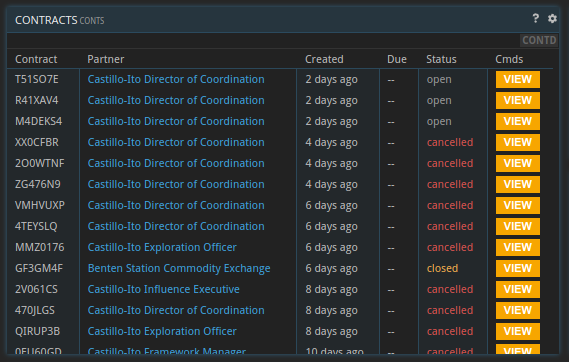
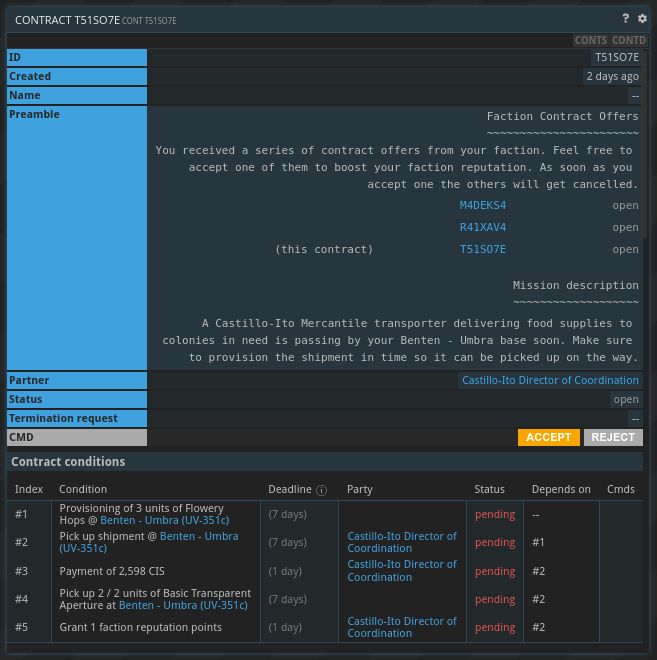
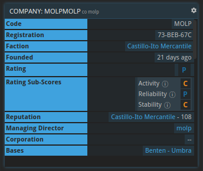
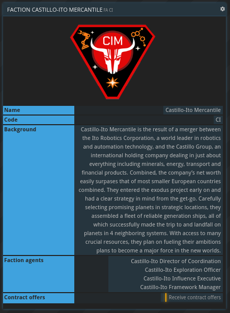

## General information

From time to time, agents of your [faction](/wiki/packages-factions/#factions) will send you a list of contract offers. These contracts span a range of tasks you'll have to fulfill, but will grant rewards in form of currency, materials or faction reputation. Accepting these contracts is optional.

## Receiving and accepting faction contracts

Once you found your first base faction agents will contact you with contract offers. These offers usually come in batches of three. You will get a notification and the contracts will appear in your `CONTS` command in the status `open`.

You can review each contract by clicking the view command. While there are certain types of contracts, each contract is a bit different, so make sure to have a proper look before accepting one.

Here is an example contract:

The preamble is divided into two sections. The 'Faction Contract Offers' part describes how this contract is part of a contract offer and has links to the other contract offers. 

The second part 'Mission Description' has a textual description of the mission and is basically a summary of the contract's conditions listed below. 

At this point you have three options:
* **Accept** the contract. The contract will move from `open` into `closed` state and behave like any other contract.
* **Reject** the contract. This will mark the contract as `rejected`.
* **Wait**. After 48 hours `open` contracts get cancelled automatically.

{}
Please note that accepting one of the contract offers will automatically cancel the other contract offers. 
{}

## Rewards and reputation

Accepting and fulfilling faction contracts is optional. There is no downside to ignoring or rejecting them other than not receiving the rewards and faction reputation. 

There are faction contract types that are very common, like the example shown above, but once in a while you will receive a rarer type. The rarer the contract type is, the higher its rewards will be.

Faction contracts offer a combination of rewards in form of currency, commodities and faction reputation points.

The amount of monetary reward depends on the type of contract and the presence of a commodity reward. Usually the monetary reward is lower if there is also a commodity reward present.

Commodity rewards will always have to be picked up at the location of your headquarters.

Successfully fulfilling faction contracts will grant faction reputation points. Everyone starts out with a faction reputation of 100. The higher the faction reputation, the higher the rewards of future faction contracts will be. The current faction reputation can be seen in the `CO` command, using your company's code:

## Disabling faction contracts

If you don't want to receive faction contract offers you can disable the offers in the respective `FA` command. You can reach that easily by clicking the name of a faction agent.

{}
