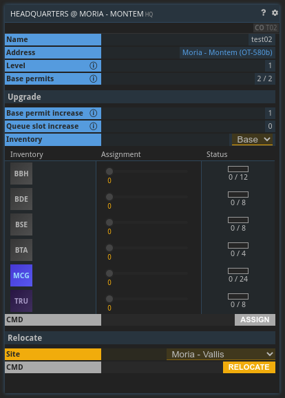

## General information

One of your bases always serves as your company headquarters. You can check on its current status via the **HQ command**.

### HQ upgrades

You can upgrade your HQ if you have the required materials in the base's storage.

Upgrading your HQ grants you one of two things:
* Most levels grant you an additional **base permit** (beyond the 2 you start with), so you can found more bases.
* Levels 5, 10, 13, 16, 18 and 20 grant you additional **queue slots** to make managing your production queues easier.

Each upgrade is more expensive than the one before. Starting from level 6, upgrading your HQ is only possible with an active [PRO license](../../wiki/pro-license).

### Faction bonuses

Depending on the faction of your HQ's location (find it in the **PLI** command of the planet your HQ is located on), it will grant you a bonus on your production efficiency in certain industries across all your bases:
* **Antares Initiative:** 10% bonus on electronics
* **Castillo-Ito Mercantile:** 10% bonus on manufacturing
* **Insitor Cooperative:** 6% bonus on agriculture, 4% on food industries
* **NEO Charter Exploration:** 4% bonus on metallurgy, 6% on construction
* **No faction:** 4% bonus each on chemistry, fuel refining and resource extraction

Furthermore, this bonus is modified by the ratio of used base permits to available base permits. The lower this ratio is the higher the bonus.
The bonus is calculated by the following formula: `Multiplier = -2 * (UsedPermits / TotalPermits) + 3`

You can relocate your HQ to another one of your bases every 30 days. It will keep its current level.

{}
