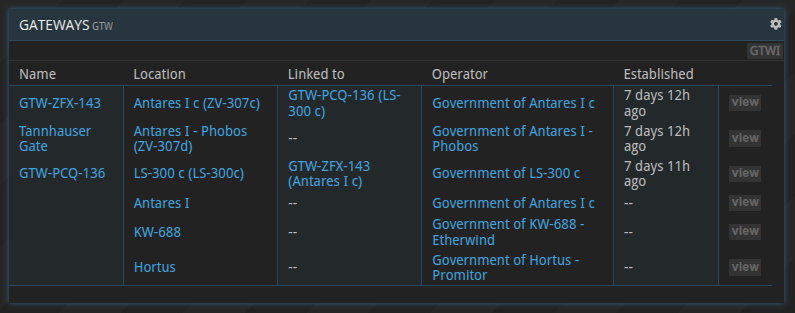
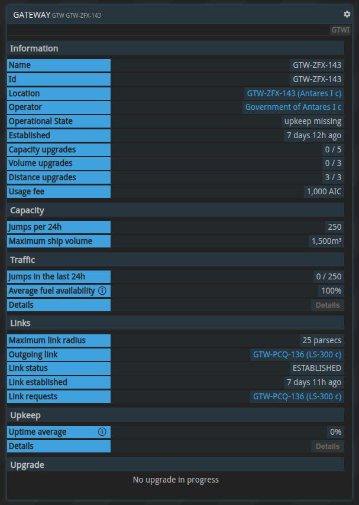
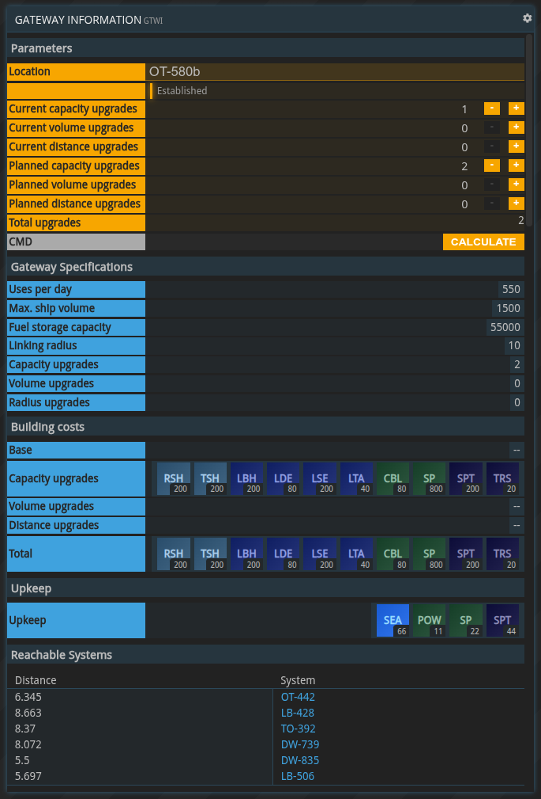
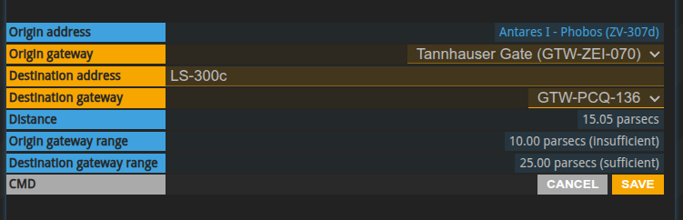
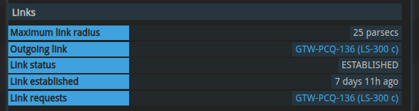
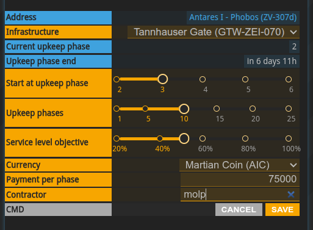
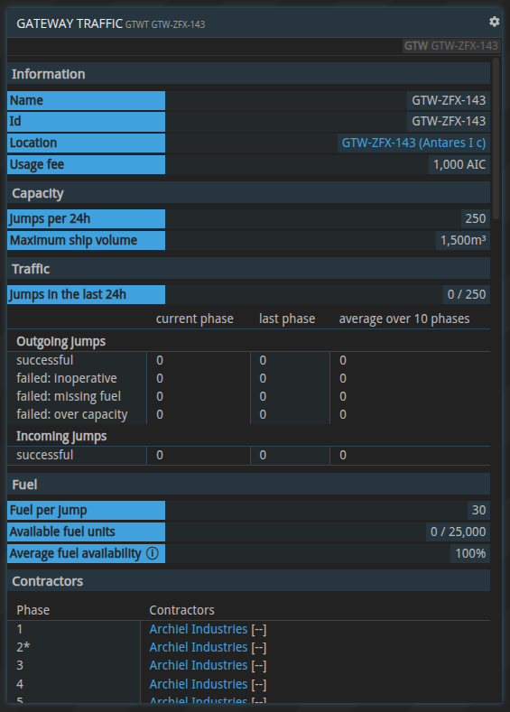
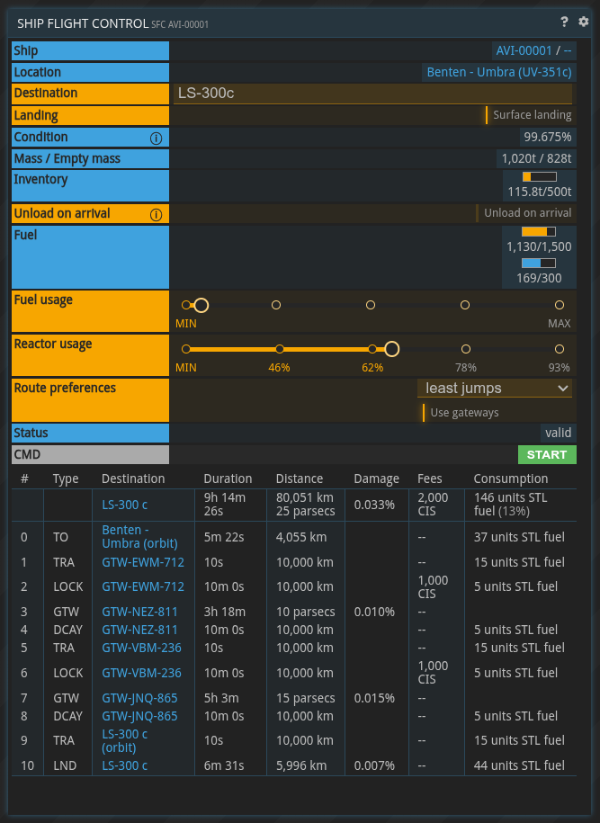
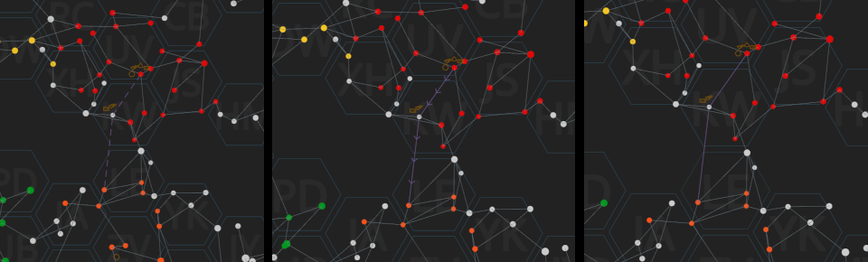

{}
This article is a preview of the upcoming gateway release.
{}

## General information

Gateways are a type of [infrastructure](../infrastructure) that form faster-than-light connections allowing ships to travel between systems that have not been connected by regular connections before. Gateways are built and operated by planetary governments.

The `GTW` command provides a list of all gateways. The command allows filtering gateways by system or planet by using an additional parameter, for example: `GTW LS-300` or `GTW LS-300c`.

When provided with a gateway id, the `GTW` command will show the details of the selected gateway:

## Gateway design and construction

The `GTWI` (gateway information) command allows planning new gateways as well as getting information about potential upgrades for existing gateways.

The key properties for gateways include:

* **Capacity**: Determines how many ships can travel through a given gateway in a rolling 24-hour window and how much Vortex Fuel can be stored in a gateway
* **Volume**: Determines the maximum volume a ship can have (in m³) to be able to make the jump through the gateway 
* **Distance**: Determines the maximum distance a destination gateway can have to form a link

All three properties can be upgraded with an infrastructure upgrade; there are limits, however: a gateway can have a maximum of five upgrades. Capacity can be upgraded up to five times, volume and distance up to three times.

`GTWI` will show the corresponding building or upgrade costs as well as the weekly upkeep costs.

The last section has an overview of all systems that are in range of the gateway with the specified configuration.

Gateways are constructed like any other infrastructure: the government creates an infrastructure construction motion and appoints a constructor. For details see [infrastructure construction](./infrastructure/#infrastructure-construction)

## Gateway linking

Gateway links are established via motions. The government selects the origin gateway and a gateway at the destination planet. The motion component will show the actual distance of the link and whether the origin and destination gateway support this distance. Both gateways have to be in range of each other to form a link.

A gateway that has not been linked yet, will have the `UNLINKED` link status. Once the linking motion has passed, the link status changes to `INCOMPLETE`. The link status will change to `ESTABLISHED` if the destination gateway passed the linking motion as well.

While a single gateway can have multiple incoming link requests from other gateways, each gateway can only be linked to a single gateway.

It is possible to unlink a gateway with the respective motion.

## Gateway fuel

Gateways require Vortex Fuel for each jump. The fuel is provided by contractors that are appointed by the government.

Similar to the general infrastructure upkeep motion, fuel contractors can be appointed for several upkeep phases. The phases align with the upkeep phases. It is possible to have multiple contractors for the same phase. The service level objective defines the minimum number of successful jumps out of all attempted jumps. Fuel contractors have access to the gateway's Vortex Fuel store.

## Gateway traffic

The `GTWT` (gateway traffic) command shows information related to gateway traffic and fuel availability. It has a table showing the jumps in the last 24 hours, the current capacity, the available fuel and the fuel contractors. A table also lists outgoing and incoming jumps in the current, last and last 10 phases. The outgoing jumps are further broken down into successful and failed jump attempts. The reasons for failed jumps include: failed due to the gateway being inoperable. This is the case when the weekly upkeep is not being paid in time. Other reasons are: failed due to missing fuel and failed due to being over capacity.

## Gateway flights

Gateways are incorporated in the `SFC` (ship flight controls) command. It is possible to plan a flight as usual, and the system will use gateways accordingly. It is possible to disable the usage of gateways in the route preferences. `SFC` will show the cost associated with a gateway jump.

Using a gateway adds three flight segments to the flight: `LOCK`, `GTW` and `DCAY`. During the `LOCK` segment, the ship waits for the gateway to prepare for the jump. The payment of the gateway fee happens here. `GTW` is the actual jump. Note that this does not require any of the ships own FTL fuel. `DCAY` happens right at the destination gateway after the jump. Once the ship is safe to continue its journey, the next segment starts.

Here is an example flight from Umbra to LS-300c using two separate gateway jumps.

If a gateway is inoperable due to missing upkeep materials, it is not possible to plan a flight using it. Gateway jumps can fail due to various reasons:

* Gateway became inoperable after the flight plan was submitted
* Not enough funds to cover the gateway fee
* Not enough Vortex Fuel to proceed with the jump
* The gateway removed or changed the link to another gateway after the flight plan was submitted

In all these cases the operator of the ship will receive a notification, and the flight automatically ends at the gateway.

Gateway connections will be shown as pink lines on the map. A solid line means that both gateways are operational and flights in both directions are possible. If the line has little arrows, flights can only happen in the indicated direction. Dashed lines are shown when both gateways are inoperable. Connections that are `INCOMPLETE` are not shown.

