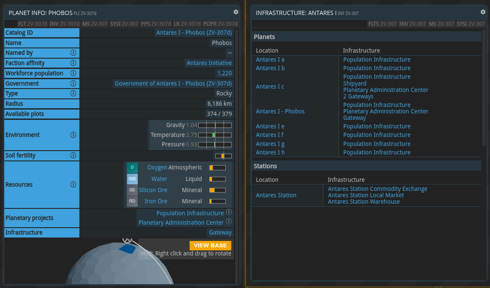
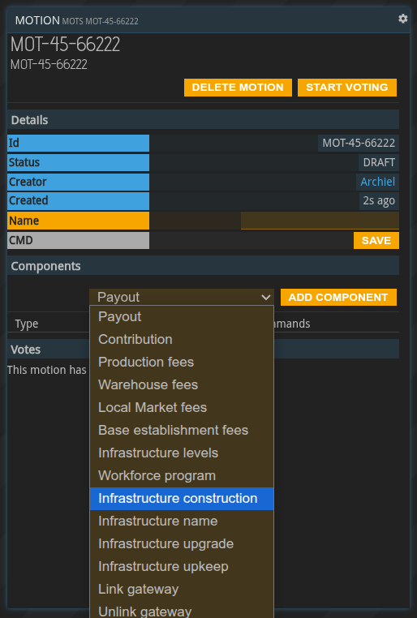
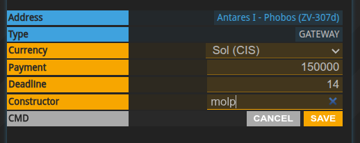
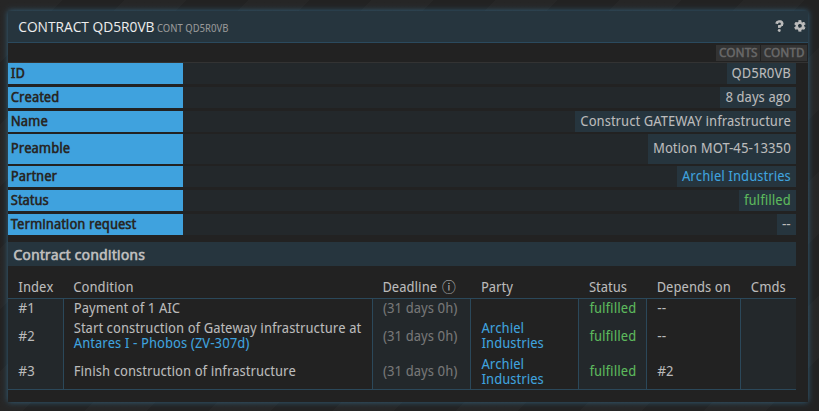
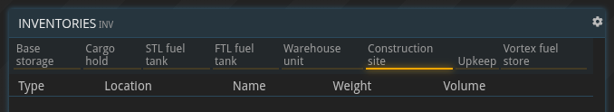
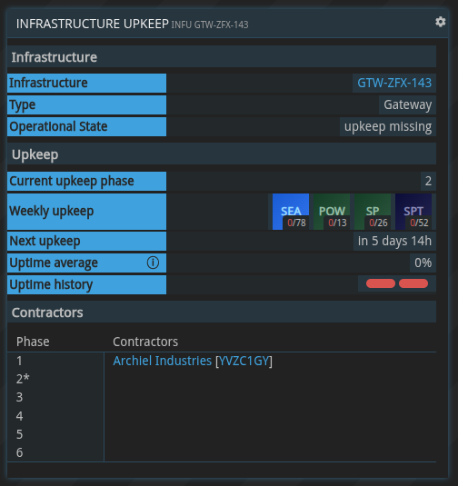
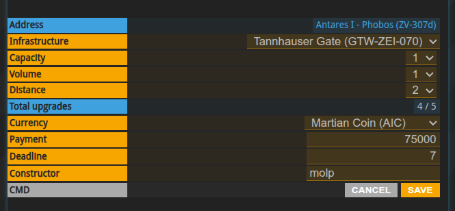
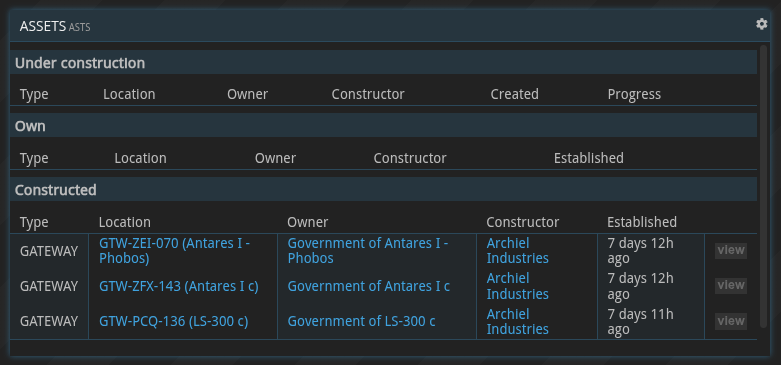

{}
本文为即将发布的Gateway更新的预览。
{}

## 一般信息

基础设施项目是由行星政府发起的大型行星级项目。它们由各个公司通过政府提供的特定承包商合同来建造和运营。

到目前为止，唯一的基础设施类型是[跃迁点](../infrastructure-gateway)。

一个行星的基础设施可在`PLI`和`INF`命令中查看。请注意，`INF`也显示行星项目。

## 基础设施建设

基础设施只能由行星政府建设。有各种与基础设施相关的动作组件，其中用于建造任意基础设施的动作是“建造基础设施”。

下面描述了建立基础设施的基本步骤。

首先，必须填写“基础设施建造”议案。该议案说明了承建方将为其服务获得的报酬。它还允许设定一个必须在其之前完成建设的最后期限。承建方可以是任何用户。

一旦议案成功通过，政府与承建商公司之间拟定一项新合同。承建商可以选择接受并履行该合同，或在错误收到合同时予以拒绝。

合同由三部分组成。首先，拟约方的付款。其次，一项由建设方触发的合同条件，用以启动建设程序。该条件必须由建设者满足。一旦满足，基础设施项目将在指定位置启动，并创建一个建设存储。最后，当所有建设材料已被运送到施工现场后，最后一项条件会自动完成，基础设施即告竣工。

请注意，位于轨道上的所有基础设施都有各自的地址。这意味着例如飞到行星轨道并不足以转移建造材料。飞船必须被设置为前往具体的基础设施或建造工地。

## 基础设施管理

大多数基础设施需要每周维护才能持续工作。`INFU`（基础设施维护）命令提供了所有与维护相关的信息概览。

它显示每个每周维护阶段所需的材料种类和数量、当前维护阶段的信息以及最近维护阶段的历史记录。

一旦所有必需的材料被转移到维护库存，基础设施的运行状态将从“缺少维护供给”切换为“运转中”。维护库存可以存放三次维护周期所需的维护材料。要获得对维护仓库的访问权限，必须通过一项议案任命承包商。只有这些承包商可以访问维护库存。

在议案编辑器中可以选择各种参数。它定义了维护合约应在哪个阶段开始以及应持续多少个阶段。它还允许指定承包商和每阶段的支付金额。运营水平定义了基础设施处于运行状态与处于“缺少维护供给”状态的最小比例。

例如，如果服务水平被定义为 50%，而承包商在维护阶段的第五天才提供必要的维护材料，则违反合同条款，因为该基础设施已经处于约 71%的“维护缺失”状态。

同一维护阶段可以有多个承包商。

## 基础设施升级

有些基础设施可以升级。可采取的议案取决于基础设施的类型。下面是一个跃迁点升级的示例：

一旦议案通过，与指定承包商的合同即告成立。一旦承包商接受合同，他们将获得对建造库存的访问权限，类似于基础设施建造合同。

升级过程中基础设施保持正常运作。

## 基础设施命名

可以为任何基础设施命名。同样，这是通过议案来实现的。基础设施的名称可以不限次数地更改。

## 资产

`ASTS`（资产）命令提供了处于各个阶段的基础设施项目概览。它列出正在建设中的基础设施项目、已拥有的基础设施（即已完成的项目）和负责建造且已建成的项目。该命令在公司和政府上下文中均可用，其内容会相应调整：公司在“自有”小节中永远不会有条目，政府不能直接建设基础设施，因此“已建造”小节将为空。

该命令还会在“建造中”部分显示指向相应建筑库存的有用链接。

