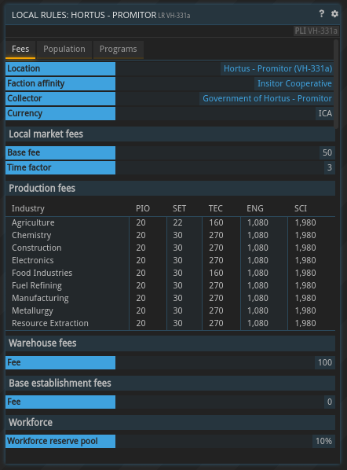

## 一般信息

本地规则是一套适用于特定地点的规则、费用和税收。本地政府可以通过议案修改本地规则。所有来自费用和税收的收入均转入政府。可以使用`LR`命令查看本地规则。下面是一个示例：

## 费用

### 本地市场费用

发布广告时需支付本地市场费用。该费用由两部分组成：基础费用和时长收费。时长收费随广告持续时间——例如广告在本地市场可见的时长——线性增加。

根据本地市场的位置，这两部分具有以下限制：

| 类型 | 基础费用 | 时长费用 |
|--------------------|-----------|-----------|
| 起始行星 | 50 - 150 | 3 - 8 |
| 派系行星 | 25 - 200 | 2 - 10 |
| 非派系行星 | 0 - 9_999 | 0 - 9_999 |

### 生产费用

生产费用在生产订单开始时必须支付。一旦订单加入队列，具体的生产费用金额便会确定。

可以为每种专业类别/劳动力类型组合定义生产费用。生产费用可以通过对给定建筑所需的所有劳动力按权重求和来计算。

根据地点不同，生产费用有以下限制：

| 类型 | 生产费用 |
|--------------------|----------------|
| 起始行星 | 10 - 90 |
| 派系行星 | 5 - 120 |
| 非派系行星 | 0 - 9_999 |

#### 示例

聚合物颗粒的生产需要一座在生产力满员时雇用 10 名先锋和 25 名定居者的聚合物工厂。
假设先锋的生产费用为 15，而定居者的为 12。总的生产费用将是

(10 * 15 + 25 * 12) / (10 + 25) = 12.9

由于聚合物颗粒只需 8 小时 24 分钟即可制造，最终生产费用为

12.9 * (8.5 / 24) = 4.56

### 仓库费用

每个租用单元的仓库费用将按周收取。如果因资金不足无法支付仓库费用，仓库库存将被锁定，用户无法访问。一旦资金到位，仓库费用会自动支付并解锁库存。

根据位置不同，仓库费用有以下限制：

| 类型 | 生产费用 |
|--------------------|----------------|
| 起始行星 | 100 - 2_500 |
| 派系行星 | 75 - 5_000 |
| 非派系行星 | 0 - 10_000 |

### 基地建造费用

基地建造费用是可选的在建造基地时收取的额外费用。其目的是帮助当地政府应对因新基地而增加的人口、基础设施维护材料和劳动力需求。

第一个基地始终免收基地建造费用。

根据位置不同，费用具有以下上限：

| 类型 | 基地建造费用 |
|--------------------|------------------------|
| 起始行星 | 0 - 10_000 |
| 派系行星 | 0 - 20_000 |
| 非派系行星 | 0 - 10_000_000 |
