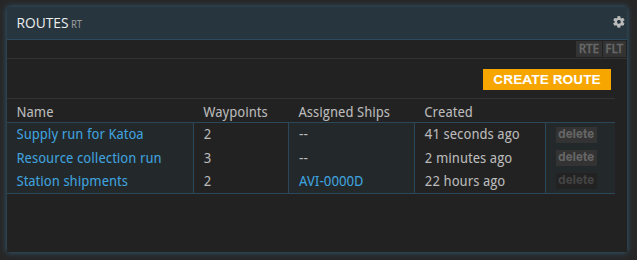
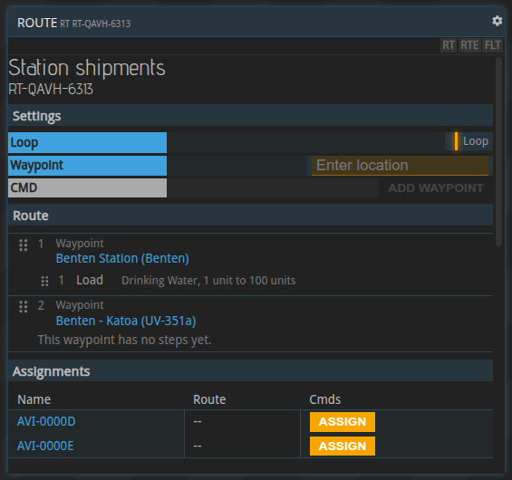
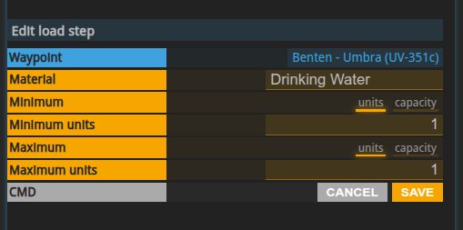
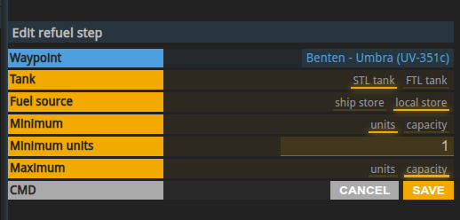
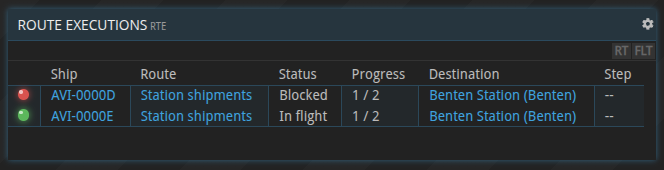
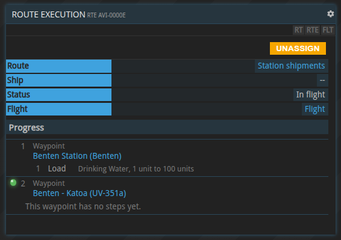

{}
Routes are currently only available as a preview on the test server.
{}

## General information

A route is a reusable list of waypoints, and each waypoint has a list of steps, such as loading cargo or refueling. A ship assigned to a route flies from waypoint to waypoint on its own and runs the steps at every stop.

Routes are managed with the `RT` command. `RTE` shows how the ships on a route are progressing. See the [commands list](../commands-list/#rt).

FREE users can create and edit routes. Assigning a ship to a route requires a [PRO license](../pro-license).

## Creating and managing routes

`RT` lists all routes of your company, `RT <route id>` opens a single route. A new route gets a generated route id and can be renamed at any time.

A route can only be deleted while no ship is assigned to it.

## Waypoints

A waypoint is a destination together with the flight settings used to get there:

* **Fuel usage** and **reactor usage**, as when planning a flight with `SFC`. Default: 25 % and 50 %.
* **Flight preferences**, for example whether to use [gateways](../infrastructure-gateway).

Waypoints can be added, removed, edited and reordered via drag-and-drop. A route needs at least two waypoints before a ship can be assigned to it.

The first waypoint is a destination, not a starting point: the ship flies there from wherever it is when it gets assigned. If it is already there, it starts right away with the waypoint's steps.

## Steps

When the ship arrives at a waypoint, it runs the waypoint's steps one after the other, in the order listed. After the last step, it flies on to the next waypoint.

The order matters: an unload step placed before a load step frees hold space that the load step can then use. Steps can be reordered via drag-and-drop.

Load, unload and refuel steps only use stores at the ship's exact location.

New steps start with default values, for example drinking water with a minimum of 1 and a maximum of 100 for a load step. Edit them after adding a step.

### Load and unload materials

A **load** step moves one material from a base or warehouse store at the waypoint into the ship's cargo hold. An **unload** step moves one material from the cargo hold into a store at the waypoint.

Both steps have a minimum and a maximum. The step moves as much as it can, up to the maximum, in a single transfer. If it can't move at least the minimum, it moves nothing and waits (see [blocked routes](#blocked-routes-and-troubleshooting)).

Minimum and maximum are either an exact number of units or **capacity**:

* Load: capacity means as much as still fits into the hold.
* Unload: capacity means everything of that material aboard.

For example, a load step with a minimum of 200 and a maximum of capacity waits until a store at the waypoint holds at least 200 units, then loads as much as fits.

A load step blocks if no store at the waypoint holds the minimum, or if the hold can't take it. It takes from the first store that holds the minimum and doesn't combine several stores. An unload step blocks if fewer units than the minimum are aboard, or if no store at the waypoint can take them.

### Refuel

A refuel step fills the ship's STL or FTL tank. The FTL tank of colony ships holds vortex fuel. The fuel comes either from the ship's cargo hold or from a store at the waypoint.

Minimum and maximum work as for loading, with capacity meaning as much as fits into the tank. One difference: the minimum never exceeds the room left in the tank. A nearly full tank is simply topped up, and a full tank completes the step without moving anything.

The step blocks if the source holds less than the minimum.

### Wait

A wait step keeps the ship at the waypoint for a set time, counted from when the step starts. The duration is given in seconds, minutes, hours or days, from 0 up to 30 days.

Changing the duration doesn't affect a wait that has already started.

### Load and unload shipments

These two steps have no settings. They move shipments along the route:

* **Load shipments** loads every shipment at the waypoint that you still have to deliver to a later waypoint of the route, or to any of its waypoints if the route repeats. Shipments go aboard in order of their delivery deadline, as long as the hold has room. Whatever doesn't fit stays behind. This step never blocks.
* **Unload shipments** unloads every shipment aboard whose delivery destination is the current waypoint. If no store there can take a shipment, the step blocks until the delivery has been fulfilled or a store has room.

The route only moves the shipments, it **doesn't fulfil contract conditions**. You still have to fulfil the pickup and delivery conditions yourself. Unloading matters because the ship leaves the waypoint after its steps: the shipment has to stay at the destination so you can fulfil the delivery.

If a shipment is too large to ever fit into the ship, you get a notification. Unless you deliver it some other way, the contract will be breached.

## Assigning a ship to a route

Ships are assigned to routes in `RT`. The ship starts flying the route immediately.

* A ship flies one route at a time. To move it to another route, unassign it first.
* A ship that is currently in flight can't be assigned.

You can unassign a ship at any time. A flight that is already underway is finished, then the ship stops. Assigning it again starts over at the first waypoint.

## Repeating routes

A repeating route starts over at the first waypoint once the steps of the last waypoint are done. Turning repeat on or off takes effect at the end of the current round trip.

A route that doesn't repeat ends after the last waypoint: the ship is unassigned and you get an alert.

## Editing a route while ships are on it

A ship keeps flying the version of the route it started with. Edits take effect when a repeating route starts its next round trip, or when a ship is assigned again.

One route can be flown by several ships at once, so an edit affects all of them.

## Monitoring route execution

`RTE` lists all ships on a route, `RTE <transponder code>` shows a single ship.

| Status           | Meaning                                                             |
|------------------|---------------------------------------------------------------------|
| Planning         | Working out the flight to the next waypoint                         |
| Awaiting mission | The flight is being calculated                                      |
| Flying           | On its way to the next waypoint                                     |
| Running steps    | At the waypoint, running its steps                                  |
| Waiting          | A wait step is counting down                                        |
| Step blocked     | A step can't run yet, for example because there isn't enough material |
| Blocked          | The flight to the next waypoint can't be planned or started         |

## Blocked routes and troubleshooting

**Step blocked**: the ship waits at the waypoint until the step can run, for example once a base has produced the minimum amount or a store has room again. The route then continues on its own. There is no timeout.

**Blocked**: the flight to the next waypoint could not be started. Common reasons are:

* the ship is not operational, for example because it is being upgraded
* not enough fuel
* no path to the destination, or the destination is out of range
* an FTL reactor is required

A blocked flight is currently not retried automatically. Fix the cause, then unassign the ship and assign it again.

Apart from shipments that can't be unloaded, a blocked route doesn't raise a notification, so check `RTE` regularly.

Routes raise alerts when:

* a route that doesn't repeat has been completed
* a repeating route stopped because the PRO license ran out
* a repeating route stopped because it has fewer than two different destinations
* a shipment is too large to ever fit into the ship
* a shipment could not be unloaded at its destination

## Routes and the PRO license

Assigning a ship to a route requires a PRO license. If the license runs out, ships on routes finish their current round trip and then stop, with an alert. A route is never stopped halfway, so no ship is stranded with cargo aboard.
